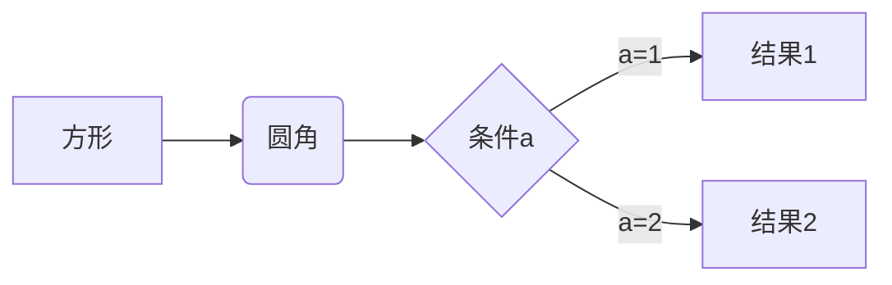
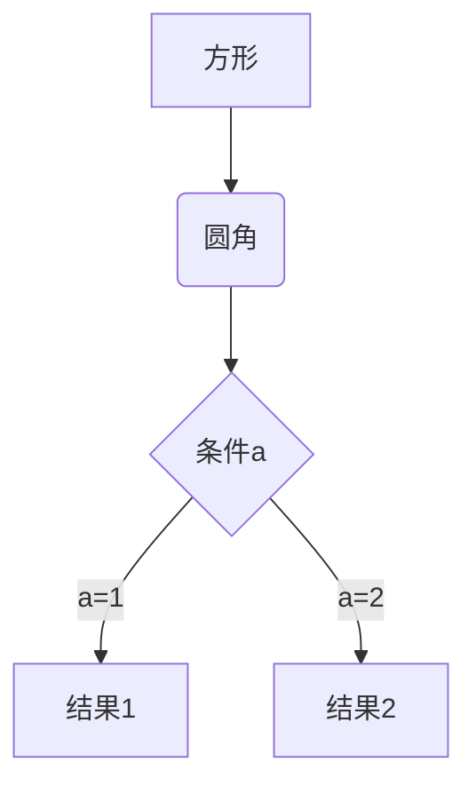
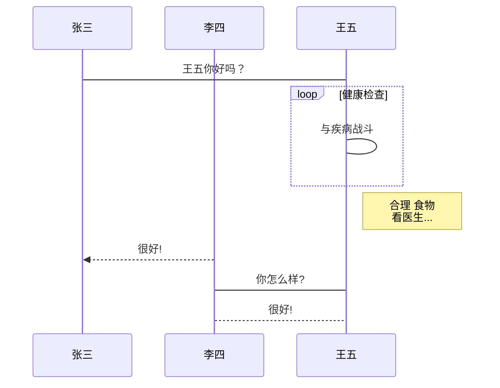
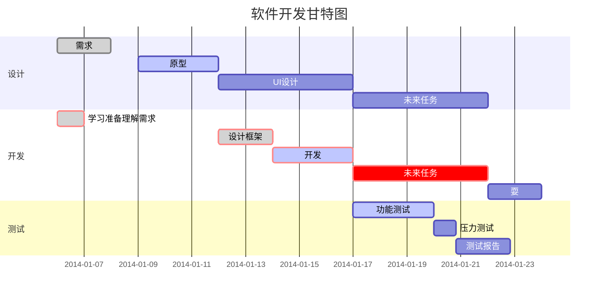

# Markdown语法

## Markdown 标题

使用 # 号+空格标记

```markdown
# 一级标题

## 二级标题

...

###### 六级标题
```

## 字体

```markdown
_斜体文本_

__粗体文本__

___粗斜体文本___
```

_斜体文本_

__粗体文本__

___粗斜体文本___

## 转义

使用反斜杠转义特殊字符

```
\   反斜线
`   反引号
*   星号
_   下划线
{}  花括号
[]  方括号
()  小括号
#   井字号
+   加号
-   减号
.   英文句点
!   感叹号
```

## Markdown 列表

### __无序列表__

减号+空格作为列表标记

```markdown
- 第一项
```

- 第一项

### __有序列表__

有序列表使用数字+.+空格来表示

```markdown
1. 第一项
```

1. 第一项

### 列表嵌套
列表嵌套只需在子列表中的选项前面添加四个空格

```markdown
1. 第一项
   - 子一项
   - 子二项
2. 第二项
3.  
```

1. 第一项
   - 子一项
   - 子二项
2. 第二项
3.  

## Markdown 区块

在段落开头使用 > +空格

```markdown
> 区块引用
```

> 区块引用
>
>  

### 区块嵌套

使用 >> +空格

```markdown
> 父区块
>> 嵌套区块
```
> 父区块
>
> > 嵌套区块

## Markdown 分隔线

三个---作为分隔线

```markdown
---
```

---

## Markdown 代码

### 代码区块

用 ``` 包裹一段代码，并指定一种语言

```javascript
$(document).ready(function () {
    alert('RUNOOB');
});
```

段落上的一个函数或片段的代码可以用`把它包起来

> `printf()`函数

## Markdown 链接

```markdown
[链接名称](链接地址)

或者

<链接地址>
```

这是一个链接 [菜鸟教程](https://www.runoob.com)

<https://www.runoob.com>

### 高级链接

通过变量来设置一个链接，变量赋值在文档末尾进行

```markdown
这个链接用 1 作为网址变量 [Google][1]
这个链接用 runoob 作为网址变量 [Runoob][runoob]
然后在文档的结尾为变量赋值（网址）

  [1]: http://www.google.com/
  [runoob]: http://www.runoob.com/
```

这个链接用 1 作为网址变量 [Google][1]
这个链接用 runoob 作为网址变量 [Runoob][runoob]
然后在文档的结尾为变量赋值（网址）

[1]: http://www.google.com/
[runoob]: http://www.runoob.com/

## Markdown 图片

```markdown

```


Markdown 还没有办法指定图片的高度与宽度，如果你需要的话，你可以使用普通的  标签。

```markdown

```

## Markdown 表格

|+空格+空格+表头+|

```markdown
|  表头   | 表头  |
|  -  | -  |
| 单元格  | 单元格 |
| 单元格  | 单元格 |
```

| 表头   | 表头   |
| - | - |
| 单元格 | 单元格 |
| 单元格 | 单元格 |

__对齐方式__

- -: 设置内容和标题栏居右对齐。
- :- 设置内容和标题栏居左对齐。
- :-: 设置内容和标题栏居中对齐。

```markdown
| 左对齐 | 右对齐 | 居中对齐 |
| :-----| ----: | :----: |
| 单元格 | 单元格 | 单元格 |
| 单元格 | 单元格 | 单元格 |
```

| 左对齐 | 右对齐 | 居中对齐 |
| :----- | -----: | :------: |
| 单元格 | 单元格 |  单元格  |
| 单元格 | 单元格 |  单元格  |

## Markdown 段落

段落的换行是使用两个以上空格加上回车。   

## Markdown 删除线

```markdown
~~BAIDU,COM~~
```

~~BAIDU.COM~~

## Markdown 下划线

```markdown
<u>带下划线文本</u>
```

<u>带下划线文本</u>

## 脚注

```markdown
创建脚注格式类似这样 [^RUNOOB]。

[^RUNOOB]: 菜鸟教程 -- 学的不仅是技术，更是梦想  
```

创建脚注格式类似这样 [^RUNOOB]。

[^RUNOOB]: 菜鸟教程 -- 学的不仅是技术，更是梦想  

---

## Markdown 高级技巧

__支持的 HTML 元素__
		不在 Markdown 涵盖范围之内的标签，都可以直接在文档里面用 HTML 撰写。

​		目前支持的 HTML 元素有：<kbd> <b> <i> <em> <sup> <sub> <br>等 ，如：

```markdown
使用 <kbd>Ctrl</kbd>+<kbd>Alt</kbd>+<kbd>Del</kbd> 重启电脑
```

> 使用 <kbd>Ctrl</kbd>+<kbd>Alt</kbd>+<kbd>Del</kbd> 重启电脑

__公式__

```markdown
$$
\mathbf{V}_1 \times \mathbf{V}_2 =  \begin{vmatrix} 
\mathbf{i} & \mathbf{j} & \mathbf{k} \\
\frac{\partial X}{\partial u} &  \frac{\partial Y}{\partial u} & 0 \\
\frac{\partial X}{\partial v} &  \frac{\partial Y}{\partial v} & 0 \\
\end{vmatrix}
$$
```

$$
\mathbf{V}_1 \times \mathbf{V}_2 = 
\begin{vmatrix} 
	\mathbf{i} & \mathbf{j} & \mathbf{k} \\
	\frac{\partial X}{\partial u} & \frac{\partial Y}{\partial u} & 0 \\
	\frac{\partial X}{\partial v} &  \frac{\partial Y}{\partial v} & 0 \\
\end{vmatrix}
$$

__流程图、时序图(顺序图)、甘特图__

1. __横向流程图__
```markdown
graph LR
A[方形] -->B(圆角)
    B --> C{条件a}
    C -->|a=1| D[结果1]
    C -->|a=2| E[结果2]
```

2. __竖向流程图__
```markdown
graph TD
A[方形] --> B(圆角)
    B --> C{条件a}
    C --> |a=1| D[结果1]
    C --> |a=2| E[结果2]
```

3. __标准流程图__
```markdown
st=>start: 开始框
op=>operation: 处理框
cond=>condition: 判断框(是或否?)
sub1=>subroutine: 子流程
io=>inputoutput: 输入输出框
e=>end: 结束框
st->op->cond
cond(yes)->io->e
cond(no)->sub1(right)->op
```
```flow
st=>start: 开始框
op=>operation: 处理框
cond=>condition: 判断框(是或否?)
sub1=>subroutine: 子流程
io=>inputoutput: 输入输出框
e=>end: 结束框
st->op->cond
cond(yes)->io->e
cond(no)->sub1(right)->op
```
4. __标准流程图（横向）__
```markdown
st=>start: 开始框
op=>operation: 处理框
cond=>condition: 判断框(是或否?)
sub1=>subroutine: 子流程
io=>inputoutput: 输入输出框
e=>end: 结束框
st(right)->op(right)->cond
cond(yes)->io(bottom)->e
cond(no)->sub1(right)->op
```
```flow
st=>start: 开始框
op=>operation: 处理框
cond=>condition: 判断框(是或否?)
sub1=>subroutine: 子流程
io=>inputoutput: 输入输出框
e=>end: 结束框
st(right)->op(right)->cond
cond(yes)->io(bottom)->e
cond(no)->sub1(right)->op
```
5. __UML时序图__
```markdown
对象A->对象B: 对象B你好吗?（请求）
Note right of 对象B: 对象B的描述
Note left of 对象A: 对象A的描述(提示)
对象B-->对象A: 我很好(响应)
对象A->对象B: 你真的好吗？
```
```sequence
对象A->对象B: 对象B你好吗?（请求）
Note right of 对象B: 对象B的描述
Note left of 对象A: 对象A的描述(提示)
对象B-->对象A: 我很好(响应)
对象A->对象B: 你真的好吗？
```
6. __UML时序图源码复杂样例__
```markdown
Title: 标题：复杂使用
对象A->对象B: 对象B你好吗?（请求）
Note right of 对象B: 对象B的描述
Note left of 对象A: 对象A的描述(提示)
对象B-->对象A: 我很好(响应)
对象B->小三: 你好吗
小三-->>对象A: 对象B找我了
对象A->对象B: 你真的好吗？
Note over 小三,对象B: 我们是朋友
participant C
Note right of C: 没人陪我玩
```
```sequence
Title: 标题：复杂使用
对象A->对象B: 对象B你好吗?（请求）
Note right of 对象B: 对象B的描述
Note left of 对象A: 对象A的描述(提示)
对象B-->对象A: 我很好(响应)
对象B->小三: 你好吗
小三-->>对象A: 对象B找我了
对象A->对象B: 你真的好吗？
Note over 小三,对象B: 我们是朋友
participant C
Note right of C: 没人陪我玩
```
7. __UML标准时序图__
```markdown
%% 时序图例子,-> 直线，-->虚线，->>实线箭头
  sequenceDiagram
    participant 张三
    participant 李四
    张三->王五: 王五你好吗？
    loop 健康检查
        王五->王五: 与疾病战斗
    end
    Note right of 王五: 合理 食物 <br/>看医生...
    李四-->>张三: 很好!
    王五->李四: 你怎么样?
    李四-->王五: 很好!
```

8. __甘特图__
```markdown
%% 语法示例
        gantt
        dateFormat  YYYY-MM-DD
        title 软件开发甘特图
        section 设计
        需求                      :done,    des1, 2014-01-06,2014-01-08
        原型                      :active,  des2, 2014-01-09, 3d
        UI设计                     :         des3, after des2, 5d
    未来任务                     :         des4, after des3, 5d
        section 开发
        学习准备理解需求                      :crit, done, 2014-01-06,24h
        设计框架                             :crit, done, after des2, 2d
        开发                                 :crit, active, 3d
        未来任务                              :crit, 5d
        耍                                   :2d
        section 测试
        功能测试                              :active, a1, after des3, 3d
        压力测试                               :after a1  , 20h
        测试报告                               : 48h
```

9. 

