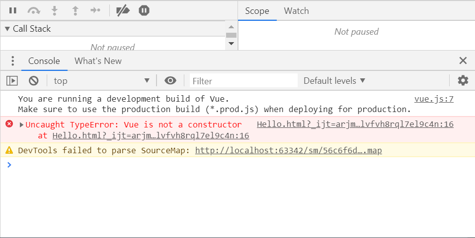

# Vue

## Hello world!

```html
<body>
    <div id="app">
        {{counter}}
        <ul>
            <li v-for="item in movies">{{item}}</li>
        </ul>
        <button v-on:click="add">+</button>
        <button v-on:click="sub">-</button>
    </div>

    <script src="../js/vue.min.js"></script>
    <script>
        let app = new Vue({
            el: "#app",
            data: {
                counter: 0,
                movies: ["aaa", "bbb", "ccc"]
            },
            methods: {
                add: function() {
                    this.counter++;
                    console.log("+");
                },
                sub: function () {
                    this.counter--;
                    console.log("-");
                }
            }
        });
    </script>
</body>
```

注意：此异常可能是由引入的vue.js为开发版本引起，改为生产版本即可！



## MVVM

## 生命周期

钩子函数：


## 选项

el: string | HTMLElement

data: Object | Function(组件当中必须是一个函数)

methods: [key: string]: Function

## 指令

- Mustache语法：{{variable}}只作用于标签内容，不能用于属性值的绑定。
- v-once：仅在初始化时渲染一次数据，后续变动无影响。
- v-html：将渲染为html标签。
- v-text：等效于Mustache语法
- v-pre：等效于\<pre\>标签
- v-cloak：斗篷，用于隐藏在加载延迟时的未渲染模板。

```html
<head>
    <meta charset="utf-8">
    <title>title</title>
    <style>
        [v-cloak] {
            display: none;
        }
    </style>
</head>
<body>
<div id="app" v-cloak>
    <h2>{{firstName + " " + lastName}}</h2>
    <h2>{{counter * 2}}</h2>
    <h2 v-once>{{message}}</h2>
    <h2 v-html="url"></h2>
    <h2 v-text="message"></h2>
    <h2 v-pre>{{origin text}}</h2>

</div>

<script src="../js/vue.min.js"></script>
<script>
    let app = new Vue({
        el: "#app",
        data: {
            message: "只初始化绑定",
            counter: 4,
            firstName: "kobe",
            lastName: "bryant",
            url: "<a href='https://www.baidu.com'>百度一下</a>"
        }
    });
</script>
</body>
```

- v-bind：用于绑定标签属性
  - `v-bind:href`可以简写为`:href`

```html
<body>
<div id="app">
    
    <a :href="mHref">百度一下</a>
</div>

<script src="../js/vue.min.js"></script>
<script>
    let app = new Vue({
        el: "#app",
        data: {
            imageURL: "https://img.jpg",
            mHref: "https://www.baidu.com"
        }
    });
</script>
</body>
```

​		绑定class

```html
<head>
    <meta charset="UTF-8">
    <title>Title</title>
    <style>
        .active {
            color: #ff0000;
        }
    </style>
</head>
<body>
<div id="app">
    <h2 class="title" :class="{active: isActive, line: isLine}">{{message}}</h2>
    <button v-on:click="btnClick">点我</button>
</div>
<script src="../js/vue.min.js"></script>
<script>
    let app = new Vue({
        el: "#app",
        data: {
            message: "hello world!",
            isActive: true,
            isLine: true
        },
        methods: {
            btnClick: function () {
                this.isActive = !this.isActive;
            }
        }
    });
</script>
</body>
```

## 计算属性

```html
<body>
<div id="app">
    <h2>{{totalPrice}}</h2>
</div>

<script src="../js/vue.min.js"></script>
<script>
    let app = new Vue({
        el: "#app",
        data: {
            books: [
                {id: "001", name: "Unix", price: 100},
                {id: "002", name: "Linux", price: 100},
                {id: "003", name: "Java", price: 100},
                {id: "004", name: "Python", price: 100}
            ]
        },
        computed: {
            totalPrice: function() {
                let price = 0;
                for (let i = 0; i < this.books.length; i++) {
                    price += this.books[i].price;
                }
                return price;
            }
        }
    });
</script>
</body>
```

- set和get属性

  ​		由于几乎所有情况下只用到get方法，因此直接声明function成为get方法的默认写法。

```js
computed: {
  // 计算属性一般没有set属性，即为只读属性
  fullName: {
    set: function (newValue) {
      let name = newValue.split(" ");
      this.firstName = name[0];
      this.lastName = name[1];
    },
    get: function () {
      return this.firstName + " " + this.lastName;
    }
  }
},
```

- 计算属性的缓存

  相比于methods，computed方法，如果变量没有变化，只会调用一次。

## 事件监听

- v-on，缩写：@

  ```html
  <body>
  <div id="app">
      <h2>{{counter}}</h2>
      <button v-on:click="inc">+</button>
      <button @click="dec">-</button>
  </div>
  <script src="../js/vue.min.js"></script>
  <script>
      let app = new Vue({
          el: "#app",
          data: {
              counter: 0
          },
          methods: {
              inc() {
                  this.counter++;
              },
              dec() {
                  this.counter--;
              }
          }
      });
  </script>
  </body>
  ```

- v-on参数问题

  如果在调用有参函数时，不传参数，会默认传递mouseEvent对象。若想显式传递，用$event

- v-on修饰符

  .stop：调用event.stopPropagation()

  .prevent：调用event.preventDefault()

  .{keyCode | keyAlias}：监听指定键事件

  .native：监听组件根元素的原生事件

  .once：只触发一次回调

  ```html
  <body>
  <div id="app">
      <div @click="divClick">
          aaaaaa
          <button @click.stop="btnClick">阻止冒泡事件</button>
      </div>
      <hr/>
  
      <form action="baidu">
          <input type="submit" value="阻止默认事件" @click.prevent="formClick"/>
      </form>
      <hr/>
      <input type="input" @keyUp.enter="keyUp">
  </div>
  <script src="../js/vue.min.js"></script>
  <script>
      let app = new Vue({
          el: "#app",
          data: {
              counter: 0
          },
          methods: {
              btnClick() {
                  console.log("btnClick")
              },
              divClick() {
                  console.log("divClick")
              },
              formClick() {
                  console.log("formClick")
              },
              keyUp() {
                  console.log("keyUp")
              }
          }
      });
  </script>
  </body>
  ```

## 条件判断

```html
<body>
<div id="app">
    <h2 v-if="score >= 90">优</h2>
    <h2 v-else-if="score >= 80">良</h2>
    <h2 v-else-if="score >= 70">中</h2>
    <h2 v-else>差</h2>
</div>
<script src="../js/vue.min.js"></script>
<script>
    let app = new Vue({
        el: "#app",
        data: {
            score: 80
        }
    });
</script>
</body>
```

## 虚拟dom复用问题

​		加入key属性，使其不复用。

```html
<body>
<div id="app">
    <span v-if="isUser">
        <label for="username">用户名</label>
        <input type="text" id="username" key="username"/>
    </span>
    <span v-else>
        <label for="email">邮箱</label>
        <input type="email" id="email" key="email"/>
    </span>
    <button @click="isUser = !isUser">切换</button>
</div>
<script src="../js/vue.min.js"></script>
<script>
    let app = new Vue({
        el: "#app",
        data: {
            isUser: true
        }
    });
</script>
</body>
```

## v-show

​		与v-if间区别，v-if为false时，从dom中删除元素，v-show仅隐藏。

## 循环

​		建议在v-for中绑定key，以优化diff算法效率。

```html
<body>
<div id="app">
    <ul>
        <li v-for="(value, key, index) in person" :key="value">
            {{index}}.{{key}}: {{value}}
        </li>
    </ul>
</div>
<script src="../js/vue.min.js"></script>
<script>
    let app = new Vue({
        el: "#app",
        data: {
            person: {
                name: "why",
                height: 1.88,
                age: 18
            }
        }
    });
</script>
</body>
```

​		数组中可以做到响应式的方法：

- push()/pop()
- shift()/unshift()
- splice()
- sort()
- reverse()
- Vue.set()

索引修改数组元素不可以响应