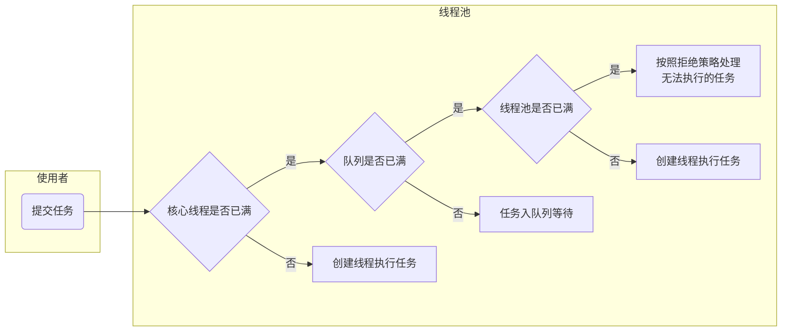

# 分布式、高并发、多线程

[https://blog.csdn.net/weixin_33978016/article/details/92716959](https://blog.csdn.net/weixin_33978016/article/details/92716959)

## 1. 分布式

分布式更多的是一个概念，为了解决单个物理服务器容量和性能瓶颈问题而采用的优化手段。该领域需要解决的问题极多，在不同的技术层面上，又包括：分布式文件系统、分布式缓存、分布式数据库、分布式计算等，一些名词如Hadoop、zookeeper、MQ等都跟分布式有关。从理念上讲，分布式的实现有两种形式：
__水平扩展__：当一台机器扛不住流量时，就通过添加机器的方式，将流量平分到所有服务器上，所有机器都可以提供相当的服务；
__垂直拆分__：前端有多种查询需求时，一台机器扛不住，可以将不同的需求分发到不同的机器上，比如A机器处理余票查询的请求，B机器处理支付的请求。

## 2. 高并发
相对于分布式来讲，高并发在解决的问题上会集中一些，其反应的是同时有多少量：比如在线直播服务，同时有上万人观看。
高并发可以通过分布式技术去解决，将并发流量分到不同的物理服务器上。但除此之外，还可以有很多其他优化手段：比如使用缓存系统，将所有的，静态内容放到CDN等；还可以使用多线程技术将一台服务器的服务能力最大化。


## 3. 多线程
多线程是指从软件或者硬件上实现多个线程并发执行的技术，它更多的是解决CPU调度多个进程的问题，从而让这些进程看上去是同时执行（实际是交替运行的）。
这几个概念中，多线程解决的问题是最明确的，手段也是比较单一的，基本上遇到的最大问题就是线程安全。在JAVA语言中，需要对JVM内存模型、指令重排等深入了解，才能写出一份高质量的多线程代码。

## 总结：

- 分布式是从物理资源的角度去将不同的机器组成一个整体对外服务，技术范围非常广且难度非常大，有了这个基础，高并发、高吞吐等系统很容易构建；
- 高并发是从业务角度去描述系统的能力，实现高并发的手段可以采用分布式，也可以采用诸如缓存、CDN等，当然也包括多线程；
- 多线程则聚焦于如何使用编程语言将CPU调度能力最大化。

---

[https://www.cnblogs.com/sx66/p/12623437.html](https://www.cnblogs.com/sx66/p/12623437.html)

## Q&A

- **什么是进程？线程？区别？**

  进程是一个独立的运行环境，它可以被看作是一个程序或者一个应用。而线程是在进程中执行的一个任务。eg: 打开360安全卫士，它本身是一个程序，也是一个进程，它里面有杀毒，清理垃圾，电脑加速等功能，当你点击杀毒的时候，杀毒任务就相当于一个线程。

  进程是操作系统进行资源分配的基本单位，而线程是操作系统进行调度的基本单位。

  进程让操作系统的并发性成为可能，而线程让进程的内部并发成为可能。

- **什么叫线程安全?**

  一个类或者程序所提供的接口对于线程来说是原子操作或者多个线程之间的切换不会导致该接口的执行结果存在二义性，也就是说我们不用考虑同步的问题。

- **出现线程不安全的原因是什么？**
  如果我们创建的多个线程，存在着共享数据，那么就有可能出现线程的安全问题：当其中一个线程操作共享数据时，还未操作完成，另外的线程就参与进来，导致对共享数据的操作出现问题。

- **线程不安全解决办法？**
  要求一个线程操作共享数据时，只有当其完成操作共享数据，其它线程才有机会执行共享数据。java提供了两种方式来实现同步互斥访问：__synchronized__和__Lock__。

- **创建线程的方式?区别?**

  __方式__

     1. 继承Thread类;
     2. 实现Runnable接口;
     3. 实现Callable接口;
     4. 通过线程池创建线程；

  __区别__

     1. Java中，类仅支持单继承，如果一个类继承了Thread类，就无法再继承其它类，因此，如果一个类既要继承其它的类，又必须创建为一个线程，就可以使用实现Runable接口的方式。
     2. 使用实现Runable接口的方式创建的线程可以处理同一资源，实现资源的共享。
     3. 使用实现Callable接口的方式创建的线程，可以获取到线程执行的返回值、是否执行完成等信息。

- **Java中Runnable和Callable有什么不同？**
  Runnable和Callable都是创建线程的方式。Runnable从JDK1.0开始就有了，Callable是在JDK1.5增加的。

     1. 实现Callable接口的任务线程能返回执行结果；而实现Runnable接口的任务线程不能返回结果；
     2. Callable接口的call()方法允许抛出异常；而Runnable接口的run()方法的异常只能在内部消化，不能继续上抛；

- **Thread 类中的start() 和run() 方法有什么区别？**
     **介绍说明**

     1. start() ：它的作用是启动一个新线程。通过start()方法来启动的新线程，处于就绪（可运行）状态，并没有运行，一旦得到cpu时间片，就开始执行相应线程的run()方法，这里方法run()称为线程体，它包含了要执行的这个线程的内容，run方法运行结束，此线程随即终止。
     2. run()：就和普通的成员方法一样，可以被重复调用。如果直接调用run方法，并不会启动新线程！程序中依然只有主线程这一个线程，其程序执行路径还是只有一条，还是要顺序执行。

     **start和run区别**

     1. start() 可以启动一个新线程，run()不能。
     2. ==start()不能被重复调用==，run()可以。
     3. start()中的run代码可以不执行完就继续执行下面的代码，即进行了线程切换。直接调用run方法必须等待其代码全部执行完才能继续执行下面的代码。
     4. start() 实现了多线程，run()没有实现多线程。

- ==**Java多线程中调用wait() 和 sleep()方法有什么不同？**==
     sleep()和wait()都是使线程暂停执行一段时间的方法。二者区别为：

     1. 原理不同(面试时可不答，偏重2,3)
     2. sleep()方法是Thread类的静态方法，是线程用来控制自身流程的。而wait()方法是Object类的方法，用于线程间的通信。
     3. 对锁的处理机制不同。调用wait()的时候方法会释放当前持有的锁，而sleep方法不会释放锁。
     4. 使用地方不同。sleep方法则可以放在任何地方使用，而wait()方法必须放在同步方法或者同步代码块中使用。
     5. sleep()方法必须捕获异常，而wait()、notify()、notifyAll()不需要捕获异常。

     **推荐**: 由于sleep不会释放锁标志，容易导致死锁问题的发生，一般情况下，不推荐使用sleep()方法，而推荐使用wait()方法。

- ==**介绍下CAS**==
     CAS(Compare and Swap)，比较与交换，实现并发算法时常用到的一种技术，是Java保证原子性的一种重要方法，也是一种乐观锁的实现方式。CAS有3个参数，内存值V，旧的预期值A，要修改的新值B。当且仅当预期值A和内存值V相同时，将内存值V修改为B，否则什么都不做。

     缺点:ABA问题

- **说说对于 synchronized 关键字的了解？**
     synchronized关键字解决的是多个线程之间访问资源的同步性；

     synchronized 关键字可以保证被它修饰的方法或者代码块在任意时刻只能有一个线程执行。

     synchronized保证了对变量操作的可见性，原子性和有序性。

     synchronized 的使用方式有三种:

     1. 修饰同步代码块
     2. 修饰非静态(实例)的方法
     3. 修饰静态的方法

     eg；双重校验锁实现单例模式使用到了synchronized

- **Lock和synchronized的区别**

  1. synchronized是Java中的关键字，在JVM层面，而Lock是一个接口；
  2. synchronized会自动释放线程占有的锁，而Lock需要主动通过unLock()去释放锁，否则可能造成死锁现象。
  3. 使用synchronized时，等待的线程会一直等待下去，不能够响应中断，而Lock可以让等待锁的线程响应中断；
  4. 通过Lock可以判断锁状态，即是否成功获取锁，而synchronized无法判断。
  5. Lock可以提高多个线程进行读操作的效率。
     

  说明:在性能上来说，如果竞争资源不激烈，两者的性能是差不多的，而当竞争资源非常激烈时（即有大量线程同时竞争），此时Lock的性能要远远优于synchronized。所以说，在具体使用时要根据适当情况。

- ==**synchronized和Lock底层实现?**==
  synchronized用的锁是存在java对象里的，通过对代码反编译，可以看出被synchronized修饰的代码块，在执行之前先使用monitorenter指令加锁，然后在执行结束之后再使用monitorexit指令释放锁资源，在整个执行期间此代码都是锁定的状态，这就是典型悲观锁的实现流程。

  lock锁使用的是CAS和volatile来实现同步的，CAS使用硬件命令实现缓存一致性保证了原子性，volatile保证了可见性，多线程环境下所有的线程通过CAS进行竞争资源，只能有一个成功，其它的都会自旋。

- ~~**在多线程中，什么是上下文切换？**~~
  ~~上下文切换是存储和恢复CPU状态的过程，它使得线程执行能够从中断点恢复执行。是多任务操作系统和多线程环境的基本特征。~~ 


- **并发编程三要素**

     1. 原子性（A）：程序中的所有操作是不可中断的,要么全部执行成功要么全部执行失败。
     2. 有序性（O）：程序执行的顺序按照代码的先后顺序执行。（处理器可能会对指令进行重排序）
     3. 可见性（V）：当多个线程访问同一个变量时，如果其中一个线程对其作了修改，其他线程能立即获取到最新的值。

- **Java中堆和栈有什么不同？(相对于线程来说)**
  栈是一块和线程紧密相关的内存区域。每个线程都有自己的栈内存，用于存储本地变量，方法参数和栈调用，一个线程中存储的变量对其它线程是不可见的。

  堆是所有线程共享的一片公用内存区域。对象都在堆里创建，为了提升效率线程会从堆中弄一个缓存到自己的栈，如果多个线程使用该变量就可能引发问题，这时volatile 变量就可以发挥作用了，它要求线程从主存中读取变量的值。

- **什么是线程池？ 为什么要使用它？**
     线程池（thread pool）：一种线程使用模式。

     创建线程要花费资源和时间，如果任务来了才创建线程那么响应时间会变长，而且一个进程能创建的线程数有限。为了避免这些问题，在程序启动的时候就创建若干线程来响应处理，它们被称为线程池，里面的线程叫工作线程。
     
     线程池的好处：
     
      1. 通过重用线程池中的线程，来减少每个线程创建和销毁的性能开销。
      2. 对线程进行一些维护和管理，比如定时开始，周期执行，并发数控制等等。

- ==**什么是ThreadLocal?**==
  ThreadLocal用于创建线程的本地变量，我们知道一个对象的所有线程共享它的全局变量，所以这些变量是非线程安全的，我们可以使用同步技术。但是当我们不想使用同步的时候，我们可以选择ThreadLocal变量。每个线程都会拥有他们自己的Thread变量，它们可以使用get()/set()方法去获取他们的默认值或者在线程内部改变他们的值。

- **死锁是什么？如何避免死锁？**
  死锁是指两个或两个以上的进程在执行过程中，因争夺资源而造成的一种互相等待的现象，若无外力作用，它们都将无法推进下去。这是一个严重的问题，因为死锁会让你的程序挂起无法完成任务，死锁的发生必须满足以下四个条件：

  1. 互斥条件：一个资源每次只能被一个进程使用。
  2. 请求与保持条件：一个进程因请求资源而阻塞时，对已获得的资源保持不放。
  3. 不剥夺条件：进程已获得的资源，在末使用完之前，不能强行剥夺。
  4. 循环等待条件：若干进程之间形成一种头尾相接的循环等待资源关系。

  避免死锁最简单的方法就是阻止循环等待条件，将系统中所有的资源设置标志位、排序，规定所有的进程申请资源必须以一定的顺序（升序或降序）做操作来避免死锁。

- ==**Thread类中的yield方法有什么作用？**==

  yield：让步，Thread.yield() 方法会使当前线程从运行状态变为就绪状态，把运行机会让给其它相同优先级的线程。它是一个静态的原生（native）方法而且只保证当前线程放弃CPU占用而不能保证使其它线程一定能占用CPU，执行yield()的线程有可能会被再次继续执行的。

- ==**Java中notify 和 notifyAll有什么区别？**==
  调用notify时，只有一个等待线程会被唤醒而且它不能保证哪个线程会被唤醒，这取决于线程调度器。如果你调用notifyAll方法，那么等待该锁的所有线程都会被唤醒。

- ==**Java中interrupted 和 isInterrupted方法的区别？**==
  interrupted() 和 isInterrupted()的主要区别是前者会将中断状态清除而后者不会。

  Java多线程的中断机制是用内部标识来实现的，调用Thread.interrupt()来中断一个线程就会设置中断标识为true。当中断线程调用静态方法Thread.interrupted()来检查中断状态时，中断状态会被清零。而非静态方法isInterrupted()用来查询其它线程的中断状态且不会改变中断状态标识。简单的说就是任何抛出InterruptedException异常的方法都会将中断状态清零。无论如何，一个线程的中断状态有有可能被其它线程调用中断来改变。

- ==**有三个线程T1，T2，T3，怎么确保它们按顺序执行？**==
  在多线程中有多种方法让线程按特定顺序执行，你可以用线程类的join()方法在一个线程中启动另一个线程，另外一个线程完成该线程继续执行。为了确保三个线程的顺序你应该先启动最后一个(T3调用T2，T2调用T1)，这样T1就会先完成而T3最后完成。

- **如何创建守护线程？**

  使用Thread类的setDaemon(true)方法可以将线程设置为守护线程，需要注意的是，需要在调用start()方法前调用这个方法，否则会抛出IllegalThreadStateException异常。

  ```java
  public class DaemonThread {
      public static void main(String[] args) {
          Thread daemonThread = new Thread(new Runnable() {
              @Override
              public void run() {
  
              }
          });
          
          daemonThread.setDaemon(true); // 设置守护线程
          daemonThread.start();
      }
  }
  ```

  **前提知识**:

  守护进程（Daemon）是运行在后台的一种特殊进程。它独立于控制终端并且周期性地执行某种任务或等待处理某些发生的事件（百度百科）。

  Java线程分为两类分别为daemon线程（守护线程）和User线程（用户线程），在JVM启动时候会调用main函数，main函数所在的线程是一个用户线程，这个是我们可以看到的线程，其实JVM内部同时还启动了好多守护线程，比如垃圾回收线程。那么守护线程和用户线程有什么区别那？区别之一是当最后一个非守护线程结束时候，JVM会正常退出，而不管当前是否有守护线程，也就是说守护线程是否结束并不影响JVM的退出。言外之意是只要有一个用户线程还没结束正常情况下JVM就不会退出。

- **什么是线程调度器(Thread Scheduler)和时间分片(Time Slicing)？**

  线程调度器是一个操作系统服务，它负责为Runnable状态的线程分配CPU时间。一旦我们创建一个线程并启动它，它的执行便依赖于线程调度器的实现。

  时间分片是指将可用的CPU时间分配给可用的Runnable线程的过程。分配CPU时间可以基于线程优先级prior或者线程等待的时间。线程调度并不受到Java虚拟机控制，所以由应用程序来控制它是更好的选择（即最好不要让你的程序依赖于线程的优先级）。

- **Java线程池中submit() 和 execute()方法有什么区别？**

  两个方法都可以向线程池提交任务，execute()方法的返回类型是void，它定义在Executor接口中, 而submit()方法可以返回持有计算结果的Future对象，它定义在ExecutorService接口中，它扩展了Executor接口，其它线程池类像ThreadPoolExecutor和ScheduledThreadPoolExecutor都有这些方法。

- **什么是FutureTask?**

  在Java并发程序中FutureTask表示一个可以取消的异步运算。它有启动和取消运算、查询运算是否完成和取回运算结果等方法。只有当运算完成的时候结果才能取回，如果运算尚未完成get方法将会阻塞。一个FutureTask对象可以对调用了Callable和Runnable的对象进行包装，由于FutureTask也是调用了Runnable接口所以它可以提交给Executor来执行。

---

[https://blog.csdn.net/blwinner/article/details/98269304](https://blog.csdn.net/blwinner/article/details/98269304)

- **==分布式系统怎么做服务治理==**
  针对互联网业务的特点，eg 突发的流量高峰、网络延时、机房故障等，重点针对大规模跨机房的海量服务进行运行态治理，保障线上服务的高SLA，满足用户的体验，常用的策略包括**限流降级、服务嵌入迁出、服务动态路由和灰度发布**等

- **对分布式事务的理解**
  本质上来说，分布式事务就是为了保证不同数据库的数据一致性。
  事务的ACID特性 原子性 一致性 隔离性 持久性
  消息事务+最终一致性
  TCC提供了一个编程框架，将整个业务逻辑分为三块：Try、Confirm和Cancel三个操作。以在线下单为例，Try阶段会去扣库存，Confirm阶段则是去更新订单状态，如果更新订单失败，则进入Cancel阶段，会去恢复库存。总之，TCC就是通过代码人为实现了两阶段提交，不同的业务场景所写的代码都不一样，复杂度也不一样，因此，这种模式并不能很好地被复用。
- ==**如何实现负载均衡，有哪些算法可以实现**==
  经常会用到以下四种算法：随机（random）、轮训（round-robin）、一致哈希（consistent-hash）和主备（master-slave）。

- ==**分布式集群下如何做到唯一序列号**==
  Redis生成ID 这主要依赖于Redis是单线程的，所以也可以用生成全局唯一的ID。可以用Redis的原子操作 INCR和INCRBY来实现。

- ~~**什么是进程**~~
  ~~进程是指运行中的应用程序，每个进程都有自己独立的地址空间（内存空间）。~~
  ~~比如用户点击桌面的IE浏览器，就启动了一个进程，操作系统就会为该进程分配独立的地址空间。当用户再次点击左边的IE浏览器，又启动了一个进程，操作系统将为新的进程分配新的独立的地址空间。目前操作系统都支持多进程。~~

- ~~**什么是线程**~~
  ~~进程是表示自愿分配的基本单位。而线程则是进程中执行运算的最小单位，即执行处理机调度的基本单位。通俗来讲：一个程序有一个进程，而一个进程可以有多个线程。~~

- ~~**线程和进程有什么区别**~~
  ~~线程是进程的子集，一个进程可以有很多线程，每条线程并行执行不同的任务。不同的进程使用不同的内存空间，而所有的线程共享一片相同的内存空间。~~

- **多线程的几种实现方式**
  
  1. 继承Thread类创建线程
     Thread类本质上是实现了Runnable接口的一个实例，代表一个线程的实例。启动线程的唯一方法就是通过Thread类的start()实例方法。start()方法将启动一个新线程，并执行run（）方法。这种方式实现多线程比较简单，通过自己的类直接继承Thread，并重写run（）方法，就可以启动新线程并执行自己定义的run()方法。
  2. 实现Runnable接口创建线程
     如果自己的类已经继承了两一个类，就无法再继承Thread，因此可以实现一个Runnable接口
     实现Callable接口通过FutureTask包装器来创建Thread线程
  3. 使用ExecutorService、Callable、Future实现有返回结果的线程
     ExecutorService、Callable、Future三个接口实际上都是属于**Executor框架**。返回结果的线程是在JDK1.5中引入的新特征，有了这种特征就不需要再为了得到返回值而大费周折了。
     可返回值的任务必须实现Callable接口；无返回值的任务必须实现Runnabel接口。
   执行Callable任务后，可以获取一个Future对象，在该对象上调用get()方法就可以获取到Callable任务返回的Object了。（get()方法是阻塞的，线程无返回结果，该方法就一直等待）
  
- ==**多线程中忙循环是什么**==
  忙循环就是程序员用循环让一个线程等待，不像传统方法wait()、sleep()或者yied()它们都放弃了CPU控制，而忙循环不会放弃CPU，它就是在运行一个空循环。这么做的目的是为了保留CPU缓存，在多核系统中，一个等待线程醒来的时候可能会在另一个内核运行，这样会重建缓存。为了避免重建缓存和减少等待重建的时间就可以使用它了。

- **什么是java内存模型**
  java内存模型定义了java虚拟机在计算机内存中的工作方式。JMM决定了一个线程对共享变量的写入何时对另一个线程可见。从抽象的角度来看，JMM定义了线程和主内存之间的抽象关系：线程之间的共享变量存储在主内存中，每一个线程都有一个私有的本地内存，本地内存中存储了该线程以读/写共享变量的副本。

- **为什么要用线程池？**
  线程池提供了一种限制和管理资源（包括执行一个任务）。 每个线程池还维护一些基本统计信息，例如已完成任务的数量。
  这里借用《Java并发编程的艺术》提到的来说一下使用线程池的好处：

  降低资源消耗。 通过重复利用已创建的线程降低线程创建和销毁造成的消耗。
  提高响应速度。 当任务到达时，任务可以不需要的等到线程创建就能立即执行。
  提高线程的可管理性。 线程是稀缺资源，如果无限制的创建，不仅会消耗系统资源，还会降低系统的稳定性，使用线程池可以进行统一的分配，调优和监控。

- **什么是乐观锁和悲观锁**
  1. 乐观锁：就像它的名字一样，对于并发间操作产生的线程安全问题持乐观状态，乐观锁认为竞争不总是会发生，因此它不需要持有锁，将“比较-替换”这两个动作作为一个原子操作尝试去修改内存中的变量，如果失败则表示发生冲突，那么就应该有相应的重试逻辑。
  2. 悲观锁：还是像它的名字一样，对于并发间操作产生的线程安全问题持悲观状态，悲观锁认为竞争总是会发生，因此每次对某资源进行操作时，都会持有一个独占的锁，就像synchronized，不管三七二十一，直接上了锁就操作资源了。

- **高并发、任务执行时间短的业务怎样使用线程池？并发不高、任务执行时间长的业务怎样使用线程池？并发高、业务执行时间长的业务怎样使用线程池？**
  1. 高并发、任务执行时间短的业务，线程池线程数可以设置为CPU核数+1，减少线程上下文的切换
  2. 并发不高、任务执行时间长的业务要区分开看：
     1. 假如是业务时间长集中在IO操作上，也就是IO密集型的任务，因为IO操作并不占用CPU，所以不要让所有的CPU闲下来，可以加大线程池中的线程数目，让CPU处理更多的业务
     2. 假如是业务时间长集中在计算操作上，也就是计算密集型任务，这个就没办法了，和（1）一样吧，线程池中的线程数设置得少一些，减少线程上下文的切换
  3. 并发高、业务执行时间长，解决这种类型任务的关键不在于线程池而在于整体架构的设计，看看这些业务里面某些数据是否能做缓存是第一步，增加服务器是第二步，至于线程池的设置，设置参考其他有关线程池的文章。最后，业务执行时间长的问题，也可能需要分析一下，看看能不能使用中间件对任务进行拆分和解耦。

---

[https://blog.csdn.net/BinBin_Jun/article/details/84934112](https://blog.csdn.net/BinBin_Jun/article/details/84934112)

- **在java中守护线程和本地线程区别？**

  java中的线程分为两种：守护线程（Daemon）和用户线程（User）。

  任何线程都可以设置为守护线程和用户线程，通过方法Thread.setDaemon(bool on)；true则把该线程设置为守护线程，反之则为用户线程。Thread.setDaemon()必须在Thread.start()之前调用，否则运行时会抛出异常。

  两者的区别： 

  唯一的区别是判断虚拟机(JVM)何时离开，Daemon是为其他线程提供服务，如果全部的User Thread已经撤离，Daemon 没有可服务的线程，JVM撤离。也可以理解为守护线程是JVM自动创建的线程（但不一定），用户线程是程序创建的线程；比如JVM的垃圾回收线程是一个守护线程，当所有线程已经撤离，不再产生垃圾，守护线程自然就没事可干了，当垃圾回收线程是Java虚拟机上仅剩的线程时，Java虚拟机会自动离开。

  ==扩展：Thread Dump打印出来的线程信息，含有daemon字样的线程即为守护进程，可能会有：服务守护进程、编译守护进程、windows下的监听Ctrl+break的守护进程、Finalizer守护进程、引用处理守护进程、GC守护进程。==

- ~~**线程与进程的区别？**~~

  ~~进程是操作系统分配资源的最小单元，线程是操作系统调度的最小单元。~~

  ~~一个程序至少有一个进程,一个进程至少有一个线程。~~

- ~~**什么是多线程中的上下文切换？**~~

  ~~多线程会共同使用一组计算机上的CPU，而线程数大于给程序分配的CPU数量时，为了让各个线程都有执行的机会，就需要轮转使用CPU。不同的线程切换使用CPU发生的切换数据等就是上下文切换。~~

- **死锁与活锁的区别，死锁与饥饿的区别？**

  死锁：是指两个或两个以上的进程（或线程）在执行过程中，因争夺资源而造成的一种互相等待的现象，若无外力作用，它们都将无法推进下去。 

  ~~产生死锁的必要条件：~~ 

  1. ~~互斥条件：所谓互斥就是进程在某一时间内独占资源。~~ 
  2. ~~求与保持条件：一个进程因请求资源而阻塞时，对已获得的资源保持不放。~~ 
  3. ~~不剥夺条件:进程已获得资源，在末使用完之前，不能强行剥夺。~~ 
  4. ~~循环等待条件:若干进程之间形成一种头尾相接的循环等待资源关系。~~

  活锁：任务或者执行者没有被阻塞，由于某些条件没有满足，导致一直重复尝试，失败，尝试，失败。

  活锁和死锁的区别在于，处于活锁的实体是在不断的改变状态，所谓的“活”， 而处于死锁的实体表现为等待；活锁有可能自行解开，死锁则不能。

  饥饿：一个或者多个线程因为种种原因无法获得所需要的资源，导致一直无法执行的状态。 

  Java中导致饥饿的原因： 

  1. 高优先级线程吞噬所有的低优先级线程的CPU时间。
  2. 线程被永久堵塞在一个等待进入同步块的状态，因为其他线程总是能在它之前持续地对该同步块进行访问。 
  3. 线程在等待一个本身也处于永久等待完成的对象(比如调用这个对象的wait方法)，因为其他线程总是被持续地获得唤醒。

- **Java中用到的线程调度算法是什么？**

  采用时间片轮转的方式。可以设置线程的优先级，会映射到下层的系统上面的优先级上，如非特别需要，尽量不要用，防止线程饥饿。

- **什么是线程组，为什么在Java中不推荐使用？**

  ThreadGroup类，可以把线程归属到某一个线程组中，线程组中可以有线程对象，也可以有线程组，组中还可以有线程，这样的组织结构有点类似于树的形式。

  为什么不推荐使用？因为使用有很多的安全隐患吧，没有具体追究，如果需要使用，推荐使用线程池。

- **为什么使用Executor框架？**

  每次执行任务创建线程 new Thread()比较消耗性能，创建一个线程是比较耗时、耗资源的。

  调用 new Thread()创建的线程缺乏管理，被称为野线程，而且可以无限制的创建，线程之间的相互竞争会导致过多占用系统资源而导致系统瘫痪，还有线程之间的频繁交替也会消耗很多系统资源。

  直接使用new Thread() 启动的线程不利于扩展，比如定时执行、定期执行、定时定期执行、线程中断等都不便实现。

- ==**在Java中Executor和Executors的区别？**==

  Executors 工具类的不同方法按照我们的需求创建了不同的线程池，来满足业务的需求。 

  Executor 接口对象能执行我们的线程任务。 

  ExecutorService接口继承了Executor接口并进行了扩展，提供了更多的方法我们能获得任务执行的状态并且可以获取任务的返回值。 
  
  使用ThreadPoolExecutor 可以创建自定义线程池。 
  
  Future 表示异步计算的结果，他提供了检查计算是否完成的方法，以等待计算的完成，并可以使用get()方法获取计算的结果。

- **如何在Windows和Linux上查找哪个线程使用的CPU时间最长？**

- **什么是原子操作？在Java Concurrency API中有哪些原子类(atomic classes)？**

  原子操作（atomic operation）意为”不可被中断的一个或一系列操作” 。 

  处理器使用基于对缓存加锁或总线加锁的方式来实现多处理器之间的原子操作。 

  在Java中可以通过锁和循环CAS的方式来实现原子操作。 CAS操作——Compare & Set，或是 Compare & Swap，现在几乎所有的CPU指令都支持CAS的原子操作。

  原子操作是指一个不受其他操作影响的操作任务单元。原子操作是在多线程环境下避免数据不一致必须的手段。 

  int++并不是一个原子操作，所以当一个线程读取它的值并加1时，另外一个线程有可能会读到之前的值，这就会引发错误。 

  为了解决这个问题，必须保证增加操作是原子的，在JDK1.5之前我们可以使用同步技术来做到这一点。到JDK1.5，java.util.concurrent.atomic包提供了int和long类型的原子包装类，它们可以自动的保证对于他们的操作是原子的并且不需要使用同步。

  java.util.concurrent这个包里面提供了一组原子类。其基本的特性就是在多线程环境下，当有多个线程同时执行这些类的实例包含的方法时，具有排他性，即当某个线程进入方法，执行其中的指令时，不会被其他线程打断，而别的线程就像自旋锁一样，一直等到该方法执行完成，才由JVM从等待队列中选择一个另一个线程进入，这只是一种逻辑上的理解。

  原子类：AtomicBoolean，AtomicInteger，AtomicLong，AtomicReference 

  原子数组：AtomicIntegerArray，AtomicLongArray，AtomicReferenceArray 

  原子属性更新器：AtomicLongFieldUpdater，AtomicIntegerFieldUpdater，AtomicReferenceFieldUpdater 

  解决ABA问题的原子类：AtomicMarkableReference（通过引入一个boolean来反映中间有没有变过），AtomicStampedReference（通过引入一个int来累加来反映中间有没有变过）

- ~~**Java Concurrency API中的Lock接口(Lock interface)是什么？对比同步它有什么优势？**~~

  ~~Lock接口比同步方法和同步块提供了更具扩展性的锁操作。~~ 

  ~~他们允许更灵活的结构，可以具有完全不同的性质，并且可以支持多个相关类的条件对象。~~

  ~~它的优势有：~~

  1. ~~可以使锁更公平~~

  2. ~~可以使线程在等待锁的时候响应中断~~

  3. ~~可以让线程尝试获取锁，并在无法获取锁的时候立即返回或者等待一段时间~~

  4. ~~可以在不同的范围，以不同的顺序获取和释放锁~~

  ~~整体上来说Lock是synchronized的扩展版，Lock提供了无条件的、可轮询的(tryLock方法)、定时的(tryLock带参方法)、可中断的(lockInterruptibly)、可多条件队列的(newCondition方法)锁操作。另外Lock的实现类基本都支持非公平锁(默认)和公平锁，synchronized只支持非公平锁，当然，在大部分情况下，非公平锁是高效的选择。~~

- **什么是Executors框架？**

  Executor框架是一个根据一组执行策略调用，调度，执行和控制的异步任务的框架。

  无限制的创建线程会引起应用程序内存溢出。所以创建一个线程池是个更好的的解决方案，因为可以限制线程的数量并且可以回收再利用这些线程。利用Executors框架可以非常方便的创建一个线程池。

- ==**什么是阻塞队列？阻塞队列的实现原理是什么？如何使用阻塞队列来实现生产者-消费者模型？**==

  阻塞队列（BlockingQueue）是一个支持两个附加操作的队列。

  这两个附加的操作是：在队列为空时，获取元素的线程会等待队列变为非空。当队列满时，存储元素的线程会等待队列可用。

  阻塞队列常用于生产者和消费者的场景，生产者是往队列里添加元素的线程，消费者是从队列里拿元素的线程。阻塞队列就是生产者存放元素的容器，而消费者也只从容器里拿元素。

  JDK7提供了7个阻塞队列。分别是： 

  - ArrayBlockingQueue ：一个由数组结构组成的有界阻塞队列。 
  - LinkedBlockingQueue ：一个由链表结构组成的有界阻塞队列。 
  - PriorityBlockingQueue ：一个支持优先级排序的无界阻塞队列。 
  - DelayQueue：一个使用优先级队列实现的无界阻塞队列。 
  - SynchronousQueue：一个不存储元素的阻塞队列。 
  - LinkedTransferQueue：一个由链表结构组成的无界阻塞队列。 
  - LinkedBlockingDeque：一个由链表结构组成的双向阻塞队列。

  Java 5之前实现同步存取时，可以使用普通的一个集合，然后在使用线程的协作和线程同步可以实现生产者，消费者模式，主要的技术就是用好，wait ,notify,notifyAll,sychronized这些关键字。而在java 5之后，可以使用阻塞队列来实现，此方式大大简少了代码量，使得多线程编程更加容易，安全方面也有保障。 

  BlockingQueue接口是Queue的子接口，它的主要用途并不是作为容器，而是作为线程同步的的工具，因此他具有一个很明显的特性，当生产者线程试图向BlockingQueue放入元素时，如果队列已满，则线程被阻塞，当消费者线程试图从中取出一个元素时，如果队列为空，则该线程会被阻塞，正是因为它所具有这个特性，所以在程序中多个线程交替向BlockingQueue中放入元素，取出元素，它可以很好的控制线程之间的通信。

  阻塞队列使用最经典的场景就是socket客户端数据的读取和解析，读取数据的线程不断将数据放入队列，然后解析线程不断从队列取数据解析。

- **什么是Callable和Future?**

  Callable接口类似于Runnable，从名字就可以看出来了，但是Runnable不会返回结果，并且无法抛出返回结果的异常，而Callable功能更强大一些，被线程执行后，可以返回值，这个返回值可以被Future拿到，也就是说，Future可以拿到异步执行任务的返回值。 

  可以认为是带有回调的Runnable。

  Future接口表示异步任务，是还没有完成的任务给出的未来结果。所以说Callable用于产生结果，Future用于获取结果。

- **什么是FutureTask?使用ExecutorService启动任务。**

  在Java并发程序中FutureTask表示一个可以取消的异步运算。它有启动和取消运算、查询运算是否完成和取回运算结果等方法。只有当运算完成的时候结果才能取回，如果运算尚未完成get方法将会阻塞。一个FutureTask对象可以对调用了Callable和Runnable的对象进行包装，由于FutureTask也是调用了Runnable接口所以它可以提交给Executor来执行。

- ==**什么是并发容器的实现？**==

  **何为同步容器**：可以简单地理解为通过synchronized来实现同步的容器，如果有多个线程调用同步容器的方法，它们将会串行执行。比如Vector，Hashtable，以及Collections.synchronizedSet，synchronizedList等方法返回的容器。 可以通过查看Vector，Hashtable等这些同步容器的实现代码，可以看到这些容器实现线程安全的方式就是将它们的状态封装起来，并在需要同步的方法上加上关键字synchronized。

  **并发容器**使用了与同步容器完全不同的加锁策略来提供更高的并发性和伸缩性，例如在ConcurrentHashMap中采用了一种粒度更细的加锁机制，可以称为分段锁，在这种锁机制下，允许任意数量的读线程并发地访问map，并且执行读操作的线程和写操作的线程也可以并发的访问map，同时允许一定数量的写操作线程并发地修改map，所以它可以在并发环境下实现更高的吞吐量。

- **多线程同步和互斥有几种实现方法，都是什么？**

  线程同步是指线程之间所具有的一种制约关系，一个线程的执行依赖另一个线程的消息，当它没有得到另一个线程的消息时应等待，直到消息到达时才被唤醒。 

  线程互斥是指对于共享的进程系统资源，在各单个线程访问时的排它性。当有若干个线程都要使用某一共享资源时，任何时刻最多只允许一个线程去使用，其它要使用该资源的线程必须等待，直到占用资源者释放该资源。线程互斥可以看成是一种特殊的线程同步。

  线程间的同步方法大体可分为两类：用户模式和内核模式。顾名思义，内核模式就是指利用系统内核对象的单一性来进行同步，使用时需要切换内核态与用户态，而用户模式就是不需要切换到内核态，只在用户态完成操作。 

  用户模式下的方法有：原子操作（例如一个单一的全局变量），临界区。

  内核模式下的方法有：事件，信号量，互斥量。

- ==**什么是竞争条件？你怎样发现和解决竞争？**==

  当多个进程都企图对共享数据进行某种处理，而最后的结果又取决于进程运行的顺序时，则我们认为这发生了竞争条件（race condition）。

- **为什么我们调用start()方法时会执行run()方法，为什么我们不能直接调用run()方法？**

  当你调用start()方法时你将创建新的线程，并且执行在run()方法里的代码。 

  但是如果你直接调用run()方法，它不会创建新的线程也不会执行调用线程的代码，只会把run方法当作普通方法去执行。

- **Java中你怎样唤醒一个阻塞的线程？**

  在Java发展史上曾经使用suspend()、resume()方法对于线程进行阻塞唤醒，但随之出现很多问题，比较典型的还是死锁问题。 

  解决方案可以使用以对象为目标的阻塞，即利用Object类的wait()和notify()方法实现线程阻塞。 

  首先，wait、notify方法是针对对象的，调用任意对象的wait()方法都将导致线程阻塞，阻塞的同时也将释放该对象的锁，相应地，调用任意对象的notify()方法则将随机解除该对象阻塞的线程，但它需要重新获取改对象的锁，直到获取成功才能往下执行；其次，wait、notify方法必须在synchronized块或方法中被调用，并且要保证同步块或方法的锁对象与调用wait、notify方法的对象是同一个，如此一来在调用wait之前当前线程就已经成功获取某对象的锁，执行wait阻塞后当前线程就将之前获取的对象锁释放。

- **==在Java中CycliBarriar和CountdownLatch有什么区别？==**

  CyclicBarrier可以重复使用，而CountdownLatch不能重复使用。 

  Java的concurrent包里面的CountDownLatch其实可以把它看作一个计数器，只不过这个计数器的操作是原子操作，同时只能有一个线程去操作这个计数器，也就是同时只能有一个线程去减这个计数器里面的值。 

  你可以向CountDownLatch对象设置一个初始的数字作为计数值，任何调用这个对象上的await()方法都会阻塞，直到这个计数器的计数值被其他的线程减为0为止。 

  所以在当前计数到达零之前，await 方法会一直受阻塞。之后，会释放所有等待的线程，await的所有后续调用都将立即返回。这种现象只出现一次——计数无法被重置。如果需要重置计数，请考虑使用 CyclicBarrier。 

  CountDownLatch的一个非常典型的应用场景是：有一个任务想要往下执行，但必须要等到其他的任务执行完毕后才可以继续往下执行。假如我们这个想要继续往下执行的任务调用一个CountDownLatch对象的await()方法，其他的任务执行完自己的任务后调用同一个CountDownLatch对象上的countDown()方法，这个调用await()方法的任务将一直阻塞等待，直到这个CountDownLatch对象的计数值减到0为止。

  CyclicBarrier一个同步辅助类，它允许一组线程互相等待，直到到达某个公共屏障点 (common barrier point)。在涉及一组固定大小的线程的程序中，这些线程必须不时地互相等待，此时 CyclicBarrier 很有用。因为该 barrier 在释放等待线程后可以重用，所以称它为循环 的 barrier。

- ==**什么是不可变对象，它对写并发应用有什么帮助？**==

  不可变对象(Immutable Objects)即对象一旦被创建，它的状态（对象的数据，也即对象属性值）就不能改变，反之即为可变对象(Mutable Objects)。 

  不可变对象的类即为不可变类(Immutable Class)。Java平台类库中包含许多不可变类，如String、基本类型的包装类、BigInteger和BigDecimal等。 

  不可变对象天生是线程安全的。它们的常量（域）是在构造函数中创建的。既然它们的状态无法修改，这些常量永远不会变。

  只有满足如下状态，一个对象才是不可变的； 

  1. 它的状态不能在创建后再被修改； 
  2. 所有域都是final类型；并且， 它被正确创建（创建期间没有发生this引用的逸出）。

- **什么是多线程中的上下文切换？**

  在上下文切换过程中，CPU会停止处理当前运行的程序，并保存当前程序运行的具体位置以便之后继续运行。从这个角度来看，上下文切换有点像我们同时阅读几本书，在来回切换书本的同时我们需要记住每本书当前读到的页码。在程序中，上下文切换过程中的“页码”信息是保存在进程控制块（PCB）中的。PCB还经常被称作“切换桢”（switchframe）。“页码”信息会一直保存到CPU的内存中，直到他们被再次使用。 

  上下文切换是存储和恢复CPU状态的过程，它使得线程执行能够从中断点恢复执行。上下文切换是多任务操作系统和多线程环境的基本特征。

- ~~**Java中用到的线程调度算法是什么？**~~

  ~~计算机通常只有一个CPU,在任意时刻只能执行一条机器指令,每个线程只有获得CPU的使用权才能执行指令.所谓多线程的并发运行,其实是指从宏观上看,各个线程轮流获得CPU的使用权,分别执行各自的任务.在运行池中,会有多个处于就绪状态的线程在等待CPU,JAVA虚拟机的一项任务就是负责线程的调度,线程调度是指按照特定机制为多个线程分配CPU的使用权.~~

  ~~有两种调度模型：分时调度模型和抢占式调度模型。~~ 

  ~~分时调度模型是指让所有的线程轮流获得cpu的使用权,并且平均分配每个线程占用的CPU的时间片这个也比较好理解。~~

  ~~java虚拟机采用抢占式调度模型，是指优先让可运行池中优先级高的线程占用CPU，如果可运行池中的线程优先级相同，那么就随机选择一个线程，使其占用CPU。处于运行状态的线程会一直运行，直至它不得不放弃CPU。~~

- ~~**什么是线程组，为什么在Java中不推荐使用？**~~

  ~~线程组和线程池是两个不同的概念，他们的作用完全不同，前者是为了方便线程的管理，后者是为了管理线程的生命周期，复用线程，减少创建销毁线程的开销。~~

- ~~**为什么使用Executor框架比使用应用创建和管理线程好？**~~

  ~~为什么要使用Executor线程池框架~~ 

  1. ~~每次执行任务创建线程 new Thread()比较消耗性能，创建一个线程是比较耗时、耗资源的。~~ 
  2. ~~调用 new Thread()创建的线程缺乏管理，被称为野线程，而且可以无限制的创建，线程之间的相互竞争会导致过多占用系统资源而导致系统瘫痪，还有线程之间的频繁交替也会消耗很多系统资源。~~ 
  3. ~~直接使用new Thread() 启动的线程不利于扩展，比如定时执行、定期执行、定时定期执行、线程中断等都不便实现。~~

  ~~使用Executor线程池框架的优点~~ 

  1. ~~能复用已存在并空闲的线程从而减少线程对象的创建从而减少了消亡线程的开销。~~
  2. ~~可有效控制最大并发线程数，提高系统资源使用率，同时避免过多资源竞争。~~ 
  3. ~~框架中已经有定时、定期、单线程、并发数控制等功能。~~ 

  ~~综上所述使用线程池框架Executor能更好的管理线程、提供系统资源使用率。~~

- ~~**java中有几种方法可以实现一个线程？**~~

  ~~继承 Thread 类~~

  ~~实现 Runnable 接口~~

  ~~实现 Callable 接口，需要实现的是 call() 方法~~

- ==**如何停止一个正在运行的线程？**==

  使用共享变量的方式 。在这种方式中，之所以引入共享变量，是因为该变量可以被多个执行相同任务的线程用来作为是否中断的信号，通知中断线程的执行。

  使用interrupt方法终止线程 

  如果一个线程由于等待某些事件的发生而被阻塞，又该怎样停止该线程呢？这种情况经常会发生，比如当一个线程由于需要等候键盘输入而被阻塞，或者调用Thread.join()方法，或者Thread.sleep()方法，在网络中调用ServerSocket.accept()方法，或者调用了DatagramSocket.receive()方法时，都有可能导致线程阻塞，使线程处于处于不可运行状态时，即使主程序中将该线程的共享变量设置为true，但该线程此时根本无法检查循环标志，当然也就无法立即中断。这里我们给出的建议是，不要使用stop()方法，而是使用Thread提供的interrupt()方法，因为该方法虽然不会中断一个正在运行的线程，但是它可以使一个被阻塞的线程抛出一个中断异常，从而使线程提前结束阻塞状态，退出堵塞代码。

- ~~**notify()和notifyAll()有什么区别？**~~

  ~~当一个线程进入wait之后，就必须等其他线程notify/notifyall,使用notifyall,可以唤醒所有处于wait状态的线程，使其重新进入锁的争夺队列中，而notify只能唤醒一个。~~

  ~~如果没把握，建议notifyAll，防止notify因为信号丢失而造成程序异常。~~

- ~~**什么是Daemon线程？它有什么意义？**~~

  ~~所谓后台(daemon)线程，是指在程序运行的时候在后台提供一种通用服务的线程，并且这个线程并不属于程序中不可或缺的部分。因此，当所有的非后台线程结束时，程序也就终止了，同时会杀死进程中的所有后台线程。反过来说， 只要有任何非后台线程还在运行，程序就不会终止。必须在线程启动之前调用setDaemon()方法，才能把它设置为后台线程。注意：后台进程在不执行finally子句的情况下就会终止其run()方法。~~

  ~~比如：JVM的垃圾回收线程就是Daemon线程，Finalizer也是守护线程。~~

- ==**java如何实现多线程之间的通讯和协作？**==

  中断 和 共享变量

- **什么是可重入锁（ReentrantLock）？**

  举例来说明锁的可重入性

  ```java
  public class UnReentrant{
      Lock lock = new ReentrantLock();
      public void outer(){
          lock.lock();
          inner();
          lock.unlock();
      }
      public void inner(){
          lock.lock();
          //do something
          lock.unlock();
      }
  }
  ```

  outer中调用了inner，outer先锁住了lock，这样inner就不能再获取lock。其实调用outer的线程已经获取了lock锁，但是不能在inner中重复利用已经获取的锁资源，这种锁即称之为 不可重入可重入就意味着：线程可以进入任何一个它已经拥有的锁所同步着的代码块。

  synchronized、ReentrantLock都是可重入的锁，可重入锁相对来说简化了并发编程的开发。

- **当一个线程进入某个对象的一个synchronized的实例方法后，其它线程是否可进入此对象的其它方法？**

  如果其他方法没有synchronized的话，其他线程是可以进入的。

  ==所以要开放一个线程安全的对象时，得保证每个方法都是线程安全的。==

- **乐观锁和悲观锁的理解及如何实现，有哪些实现方式？**

  ~~悲观锁：总是假设最坏的情况，每次去拿数据的时候都认为别人会修改，所以每次在拿数据的时候都会上锁，这样别人想拿这个数据就会阻塞直到它拿到锁。传统的关系型数据库里边就用到了很多这种锁机制，比如行锁，表锁等，读锁，写锁等，都是在做操作之前先上锁。再比如Java里面的同步原语synchronized关键字的实现也是悲观锁。~~

  ~~乐观锁：顾名思义，就是很乐观，每次去拿数据的时候都认为别人不会修改，所以不会上锁，但是在更新的时候会判断一下在此期间别人有没有去更新这个数据，可以使用版本号等机制。乐观锁适用于多读的应用类型，这样可以提高吞吐量，像数据库提供的类似于write_condition机制，其实都是提供的乐观锁。在Java中java.util.concurrent.atomic包下面的原子变量类就是使用了乐观锁的一种实现方式CAS实现的。~~

  乐观锁的实现方式： 

  1. 使用版本标识来确定读到的数据与提交时的数据是否一致。提交后修改版本标识，不一致时可以采取丢弃和再次尝试的策略。 
  2. java中的Compare and Swap即CAS ，当多个线程尝试使用CAS同时更新同一个变量时，只有其中一个线程能更新变量的值，而其它线程都失败，失败的线程并不会被挂起，而是被告知这次竞争中失败，并可以再次尝试。　CAS 操作中包含三个操作数 —— 需要读写的内存位置（V）、进行比较的预期原值（A）和拟写入的新值(B)。如果内存位置V的值与预期原值A相匹配，那么处理器会自动将该位置值更新为新值B。否则处理器不做任何操作。

  CAS缺点： 

  1. ABA问题： 

     比如说一个线程one从内存位置V中取出A，这时候另一个线程two也从内存中取出A，并且two进行了一些操作变成了B，然后two又将V位置的数据变成A，这时候线程one进行CAS操作发现内存中仍然是A，然后one操作成功。尽管线程one的CAS操作成功，但可能存在潜藏的问题。从Java1.5开始JDK的atomic包里提供了一个类AtomicStampedReference来解决ABA问题。 

  2. 循环时间长开销大： 

     对于资源竞争严重（线程冲突严重）的情况，CAS自旋的概率会比较大，从而浪费更多的CPU资源，效率低于synchronized。 

  3. 只能保证一个共享变量的原子操作： 

     当对一个共享变量执行操作时，我们可以使用循环CAS的方式来保证原子操作，但是对多个共享变量操作时，循环CAS就无法保证操作的原子性，这个时候就可以用锁。

- ==**SynchronizedMap和ConcurrentHashMap有什么区别？**==

  SynchronizedMap一次锁住整张表来保证线程安全，所以每次只能有一个线程来访为map。

  ConcurrentHashMap使用分段锁来保证在多线程下的性能。ConcurrentHashMap中则是一次锁住一个桶。ConcurrentHashMap默认将hash表分为16个桶，诸如get,put,remove等常用操作只锁当前需要用到的桶。这样，原来只能一个线程进入，现在却能同时有16个写线程执行，并发性能的提升是显而易见的。 

  另外ConcurrentHashMap使用了一种不同的迭代方式。在这种迭代方式中，当iterator被创建后集合再发生改变就不再是抛出ConcurrentModificationException，取而代之的是在改变时new新的数据从而不影响原有的数据 ，iterator完成后再将头指针替换为新的数据 ，这样iterator线程可以使用原来老的数据，而写线程也可以并发的完成改变。

- **==CopyOnWriteArrayList可以用于什么应用场景？==**

  CopyOnWriteArrayList(免锁容器)的好处之一是当多个迭代器同时遍历和修改这个列表时，不会抛出ConcurrentModificationException。在CopyOnWriteArrayList中，写入将导致创建整个底层数组的副本，而源数组将保留在原地，使得复制的数组在被修改时，读取操作可以安全地执行。

  1. 由于写操作的时候，需要拷贝数组，会消耗内存，如果原数组的内容比较多的情况下，可能导致young gc或者full gc；
  2. 不能用于实时读的场景，像拷贝数组、新增元素都需要时间，所以调用一个set操作后，读取到数据可能还是旧的,虽然CopyOnWriteArrayList 能做到最终一致性,但是还是没法满足实时性要求；

  CopyOnWriteArrayList透露的思想 

  1. 读写分离，读和写分开 
  2. 最终一致性 
  3. 使用另外开辟空间的思路，来解决并发冲突

- ==**什么叫线程安全？servlet是线程安全吗?**==

  线程安全是编程中的术语，指某个函数、函数库在多线程环境中被调用时，能够正确地处理多个线程之间的共享变量，使程序功能正确完成。

  Servlet不是线程安全的，servlet是单实例多线程的，当多个线程同时访问同一个方法，是不能保证共享变量的线程安全性的。 

  Struts2的action是多实例多线程的，是线程安全的，每个请求过来都会new一个新的action分配给这个请求，请求完成后销毁。 

  SpringMVC的Controller是线程安全的吗？不是的，和Servlet类似的处理流程。

  Struts2好处是不用考虑线程安全问题；Servlet和SpringMVC需要考虑线程安全问题，但是性能可以提升不用处理太多的gc，可以使用ThreadLocal来处理多线程的问题。

- **==volatile有什么用？能否用一句话说明下volatile的应用场景？==**

  volatile保证内存可见性和禁止指令重排。

  volatile用于多线程环境下的单次操作(单次读或者单次写)。

- **为什么代码会重排序？**

  在执行程序时，为了提供性能，处理器和编译器常常会对指令进行重排序，但是不能随意重排序，不是你想怎么排序就怎么排序，它需要满足以下两个条件：

  在单线程环境下不能改变程序运行的结果；

  存在数据依赖关系的不允许重排序

  需要注意的是：重排序不会影响单线程环境的执行结果，但是会破坏多线程的执行语义。

- **在java中wait和sleep方法的不同？**

  最大的不同是在等待时wait会释放锁，而sleep一直持有锁。wait通常被用于线程间交互，sleep通常被用于暂停执行。

  直接了解的深入一点吧：

  在Java中线程的状态一共被分成6种：

  **初始态：**NEW

  创建一个Thread对象，但还未调用start()启动线程时，线程处于初始态。

  **运行态：**RUNNABLE 

  在Java中，运行态包括**就绪态**和**运行态**。 

  ​		**就绪态** 该状态下的线程已经获得执行所需的所有资源，只要CPU分配执行权就能运行。所有就绪态的线程存放在就绪队列中。 

  ​		**运行态** 获得CPU执行权，正在执行的线程。由于一个CPU同一时刻只能执行一条线程，因此每个CPU每个时刻只有一条运行态的线程。

  **阻塞态**

  当一条正在执行的线程请求某一资源失败时，就会进入阻塞态。而在Java中，阻塞态专指请求锁失败时进入的状态。由一个阻塞队列存放所有阻塞态的线程。处于阻塞态的线程会不断请求资源，一旦请求成功，就会进入就绪队列，等待执行。PS：锁、IO、Socket等都资源。

  **等待态**

  当前线程中调用wait、join、park函数时，当前线程就会进入等待态。也有一个等待队列存放所有等待态的线程。线程处于等待态表示它需要等待其他线程的指示才能继续运行。进入等待态的线程会释放CPU执行权，并释放资源（如：锁）

  **超时等待态**

  当运行中的线程调用sleep(time)、wait、join、parkNanos、parkUntil时，就会进入该状态；它和等待态一样，并不是因为请求不到资源，而是主动进入，并且进入后需要其他线程唤醒；进入该状态后释放CPU执行权 和 占有的资源。与等待态的区别：到了超时时间后自动进入阻塞队列，开始竞争锁。

  **终止态**

  线程执行结束后的状态。

  注意：

  wait()方法会释放CPU执行权 和 占有的锁。

  sleep(long)方法仅释放CPU使用权，锁仍然占用；线程被放入超时等待队列，与yield相比，它会使线程较长时间得不到运行。

  yield()方法仅释放CPU执行权，锁仍然占用，线程会被放入就绪队列，会在短时间内再次执行。

  wait和notify必须配套使用，即必须使用同一把锁调用；

  wait和notify必须放在一个同步块中调用wait和notify的对象必须是他们所处同步块的锁对象。

- **用Java实现阻塞队列**

  参考java中的[阻塞队列](http://www.infoq.com/cn/articles/java-blocking-queue)的内容吧，直接实现有点烦。 

- ==**一个线程运行时发生异常会怎样？**==

  如果异常没有被捕获该线程将会停止执行。Thread.UncaughtExceptionHandler是用于处理未捕获异常造成线程突然中断情况的一个内嵌接口。当一个未捕获异常将造成线程中断的时候JVM会使用Thread.getUncaughtExceptionHandler()来查询线程的UncaughtExceptionHandler并将线程和异常作为参数传递给handler的uncaughtException()方法进行处理。

- ==**如何在两个线程间共享数据？**==

  在两个线程间共享变量即可实现共享。 一般来说，共享变量要求变量本身是线程安全的，然后在线程内使用的时候，如果有对共享变量的复合操作，那么也得保证复合操作的线程安全性。

- ~~**Java中notify 和 notifyAll有什么区别？**~~

  ~~notify() 方法不能唤醒某个具体的线程，所以只有一个线程在等待的时候它才有用武之地。而notifyAll()唤醒所有线程并允许他们争夺锁确保了至少有一个线程能继续运行。~~

- ==**为什么wait, notify 和 notifyAll这些方法不在thread类里面？**==

  一个很明显的原因是JAVA提供的锁是对象级的而不是线程级的，每个对象都有锁，通过线程获得。由于wait，notify和notifyAll都是锁级别的操作，所以把他们定义在Object类中因为锁属于对象。

- **什么是ThreadLocal变量？**

  ThreadLocal是Java里一种特殊的变量。每个线程都有一个ThreadLocal就是每个线程都拥有了自己独立的一个变量，竞争条件被彻底消除了。它是为创建代价高昂的对象获取线程安全的好方法，比如你可以用ThreadLocal让SimpleDateFormat变成线程安全的，因为那个类创建代价高昂且每次调用都需要创建不同的实例所以不值得在局部范围使用它，如果为每个线程提供一个自己独有的变量拷贝，将大大提高效率。首先，通过复用减少了代价高昂的对象的创建个数。其次，你在没有使用高代价的同步或者不变性的情况下获得了线程安全。

- **Java中interrupted 和 isInterrupted方法的区别？**

  interrupt方法用于中断线程。调用该方法的线程的状态为将被置为”中断”状态。 

  注意：线程中断仅仅是置线程的中断状态位，不会停止线程。需要用户自己去监视线程的状态并做处理。支持线程中断的方法（也就是线程中断后会抛出interruptedException的方法）就是在监视线程的中断状态，一旦线程的中断状态被置为“中断状态”，就会抛出中断异常。

  interrupted查询当前线程的中断状态，并且清除原状态。如果一个线程被中断了，第一次调用interrupted则返回true，第二次和后面的就返回false了。

  isInterrupted仅仅是查询当前线程的中断状态

- ~~**为什么wait和notify方法要在同步块中调用？**~~

  ~~Java API强制要求这样做，如果你不这么做，你的代码会抛出IllegalMonitorStateException异常。还有一个原因是为了避免wait和notify之间产生竞态条件。~~

- ==**为什么你应该在循环中检查等待条件?**==

  处于等待状态的线程可能会收到错误警报和伪唤醒，如果不在循环中检查等待条件，程序就会在没有满足结束条件的情况下退出。

- **Java中的同步集合与并发集合有什么区别？**

  同步集合与并发集合都为多线程和并发提供了合适的线程安全的集合，不过并发集合的可扩展性更高。在Java1.5之前程序员们只有同步集合来用且在多线程并发的时候会导致争用，阻碍了系统的扩展性。Java5介绍了并发集合像ConcurrentHashMap，不仅提供线程安全还用锁分离和内部分区等现代技术提高了可扩展性。

- ~~**什么是线程池？ 为什么要使用它？**~~

  ~~创建线程要花费昂贵的资源和时间，如果任务来了才创建线程那么响应时间会变长，而且一个进程能创建的线程数有限。为了避免这些问题，在程序启动的时候就创建若干线程来响应处理，它们被称为线程池，里面的线程叫工作线程。从JDK1.5开始，Java API提供了Executor框架让你可以创建不同的线程池。~~

- ==**怎么检测一个线程是否拥有锁？**==

  在java.lang.Thread中有一个方法叫holdsLock()，它返回true如果当且仅当当前线程拥有某个具体对象的锁。

- **你如何在Java中获取线程堆栈？**

  kill -3 [java pid] 不会在当前终端输出，它会输出到代码执行的或指定的地方去。比如，kill -3 tomcat pid, 输出堆栈到log目录下。

  Jstack [java pid] 这个比较简单，在当前终端显示，也可以重定向到指定文件中。 

  -JvisualVM：Thread Dump 不做说明，打开JvisualVM后，都是界面操作，过程还是很简单的。

- **JVM中哪个参数是用来控制线程的栈堆栈小的?**

  -Xss 每个线程的栈大小

- **Thread类中的yield方法有什么作用？**

  使当前线程从执行状态（运行状态）变为可执行态（就绪状态）

  当前线程到了就绪状态，那么接下来哪个线程会从就绪状态变成执行状态呢？可能是当前线程，也可能是其他线程，看系统的分配了。

- **Java中ConcurrentHashMap的并发度是什么？**

  ConcurrentHashMap把实际map划分成若干部分来实现它的可扩展性和线程安全。这种划分是使用并发度获得的，它是ConcurrentHashMap类构造函数的一个可选参数，默认值为16，这样在多线程情况下就能避免争用。

  在JDK8后，它摒弃了Segment（锁段）的概念，而是启用了一种全新的方式实现,利用CAS算法。同时加入了更多的辅助变量来提高并发度，具体内容还是查看源码吧。

- **==Java中Semaphore是什么？==**

  Java中的Semaphore是一种新的同步类，它是一个计数信号。从概念上讲，从概念上讲，信号量维护了一个许可集合。如有必要，在许可可用前会阻塞每一个 acquire()，然后再获取该许可。每个 release()添加一个许可，从而可能释放一个正在阻塞的获取者。但是，不使用实际的许可对象，Semaphore只对可用许可的号码进行计数，并采取相应的行动。信号量常常用于多线程的代码中，比如数据库连接池。

- **Java线程池中submit() 和 execute()方法有什么区别？**

  两个方法都可以向线程池提交任务，execute()方法的返回类型是void，它定义在Executor接口中。

  而submit()方法可以返回持有计算结果的Future对象，它定义在ExecutorService接口中，它扩展了Executor接口，其它线程池类像ThreadPoolExecutor和ScheduledThreadPoolExecutor都有这些方法。

- **什么是阻塞式方法？**

  阻塞式方法是指程序会一直等待该方法完成期间不做其他事情，ServerSocket的accept()方法就是一直等待客户端连接。这里的阻塞是指调用结果返回之前，当前线程会被挂起，直到得到结果之后才会返回。此外，还有异步和非阻塞式方法在任务完成前就返回。

- **Java中的ReadWriteLock是什么？**

  读写锁是用来提升并发程序性能的锁分离技术的成果。

- **==volatile 变量和 atomic 变量有什么不同？==**

  volatile变量可以确保先行关系，即写操作会发生在后续的读操作之前, 但它并不能保证原子性。例如用volatile修饰count变量那么 count++ 操作就不是原子性的。

  而AtomicInteger类提供的atomic方法可以让这种操作具有原子性如getAndIncrement()方法会原子性的进行增量操作把当前值加一，其它数据类型和引用变量也可以进行相似操作。

- **可以直接调用Thread类的run ()方法么？**

  当然可以。但是如果我们调用了Thread的run()方法，它的行为就会和普通的方法一样，会在当前线程中执行。为了在新的线程中执行我们的代码，必须使用Thread.start()方法。

- **如何让正在运行的线程暂停一段时间？**

  我们可以使用Thread类的Sleep()方法让线程暂停一段时间。需要注意的是，这并不会让线程终止，一旦从休眠中唤醒线程，线程的状态将会被改变为Runnable，并且根据线程调度，它将得到执行。

- **你对线程优先级的理解是什么？**

  每一个线程都是有优先级的，一般来说，高优先级的线程在运行时会具有优先权，但这依赖于线程调度的实现，这个实现是和操作系统相关的(OS dependent)。我们可以定义线程的优先级，但是这并不能保证高优先级的线程会在低优先级的线程前执行。线程优先级是一个int变量(从1-10)，1代表最低优先级，10代表最高优先级。

  java的线程优先级调度会委托给操作系统去处理，所以与具体的操作系统优先级有关，如非特别需要，一般无需设置线程优先级

- **什么是线程调度器(Thread Scheduler)和时间分片(Time Slicing )？**

  线程调度器是一个操作系统服务，它负责为Runnable状态的线程分配CPU时间。一旦我们创建一个线程并启动它，它的执行便依赖于线程调度器的实现。 

  同上一个问题，线程调度并不受到Java虚拟机控制，所以由应用程序来控制它是更好的选择（也就是说不要让你的程序依赖于线程的优先级）。

  时间分片是指将可用的CPU时间分配给可用的Runnable线程的过程。分配CPU时间可以基于线程优先级或者线程等待的时间。

- **你如何确保main()方法所在的线程是Java 程序最后结束的线程？**

  我们可以使用Thread类的join()方法来确保所有程序创建的线程在main()方法退出前结束。

- **线程之间是如何通信的？**

  当线程间是可以共享资源时，线程间通信是协调它们的重要的手段。Object类中wait()\notify()\notifyAll()方法可以用于线程间通信关于资源的锁的状态。

- **为什么线程通信的方法wait(), notify()和notifyAll()被定义在Object 类里？**

  Java的每个对象中都有一个锁(monitor，也可以成为监视器) 并且wait()，notify()等方法用于等待对象的锁或者通知其他线程对象的监视器可用。在Java的线程中并没有可供任何对象使用的锁和同步器。这就是为什么这些方法是Object类的一部分，这样Java的每一个类都有用于线程间通信的基本方法。

- **为什么wait(), notify()和notifyAll ()必须在同步方法或者同步块中被调用？**

  当一个线程需要调用对象的wait()方法的时候，这个线程必须拥有该对象的锁，接着它就会释放这个对象锁并进入等待状态直到其他线程调用这个对象上的notify()方法。同样的，当一个线程需要调用对象的notify()方法时，它会释放这个对象的锁，以便其他在等待的线程就可以得到这个对象锁。由于所有的这些方法都需要线程持有对象的锁，这样就只能通过同步来实现，所以他们只能在同步方法或者同步块中被调用。

- **为么Thread类的sleep()和yield ()方法是静态的？**

  Thread类的sleep()和yield()方法将在当前正在执行的线程上运行。所以在其他处于等待状态的线程上调用这些方法是没有意义的。这就是为什么这些方法是静态的。它们可以在当前正在执行的线程中工作，并避免程序员错误的认为可以在其他非运行线程调用这些方法。

- **如何确保线程安全？**

  在Java中可以有很多方法来保证线程安全——同步，使用原子类(atomic concurrent classes)，实现并发锁，使用volatile关键字，使用不变类和线程安全类。

- **同步方法和同步块，哪个是更好的选择？**

  同步块是更好的选择，因为它不会锁住整个对象（当然你也可以让它锁住整个对象）。同步方法会锁住整个对象，哪怕这个类中有多个不相关联的同步块，这通常会导致他们停止执行并需要等待获得这个对象上的锁。

  同步块更要符合开放调用的原则，只在需要锁住的代码块锁住相应的对象，这样从侧面来说也可以避免死锁。

- **如何创建守护线程？**

  使用Thread类的setDaemon(true)方法可以将线程设置为守护线程，需要注意的是，需要在调用start()方法前调用这个方法，否则会抛出IllegalThreadStateException异常。

- **什么是Java Timer 类？如何创建一个有特定时间间隔的任务？**

  java.util.Timer是一个工具类，可以用于安排一个线程在未来的某个特定时间执行。Timer类可以用安排一次性任务或者周期任务。 

  java.util.TimerTask是一个实现了Runnable接口的抽象类，我们需要去继承这个类来创建我们自己的定时任务并使用Timer去安排它的执行。 

  目前有开源的Qurtz可以用来创建定时任务。

---

[https://my.oschina.net/u/3391025/blog/3096480](https://my.oschina.net/u/3391025/blog/3096480)

### 一、请你谈谈对volatile的理解

 `Package java.util.concurrent`---> `AtomicInteger` `Lock` `ReadWriteLock`

#### 1、volatile是java虚拟机提供的轻量级的同步机制

保证可见性、不保证原子性、禁止指令重排

1. 保证可见性

   当多个线程访问同一个变量时，一个线程修改了这个变量的值，其他线程能够立即看到修改的值

   当不添加volatile关键字时示例：

   ```java
   package com.jian8.juc;
   
   import java.util.concurrent.TimeUnit;
   
   /**
    * 1验证volatile的可见性
    * 1.1 如果int num = 0，number变量没有添加volatile关键字修饰
    * 1.2 添加了volatile，可以解决可见性
    */
   public class VolatileDemo {
   
       public static void main(String[] args) {
           visibilityByVolatile();//验证volatile的可见性
       }
   
       /**
        * volatile可以保证可见性，及时通知其他线程，主物理内存的值已经被修改
        */
       public static void visibilityByVolatile() {
           MyData myData = new MyData();
   
           //第一个线程
           new Thread(() -> {
               System.out.println(Thread.currentThread().getName() + "\t come in");
               try {
                   //线程暂停3s
                   TimeUnit.SECONDS.sleep(3);
                   myData.addToSixty();
                   System.out.println(Thread.currentThread().getName() + "\t update value:" + myData.num);
               } catch (Exception e) {
                   // TODO Auto-generated catch block
                   e.printStackTrace();
               }
           }, "thread1").start();
           //第二个线程是main线程
           while (myData.num == 0) {
               //如果myData的num一直为零，main线程一直在这里循环
           }
           System.out.println(Thread.currentThread().getName() + "\t mission is over, num value is " + myData.num);
       }
   }
   
   class MyData {
       //    int num = 0;
       volatile int num = 0;
   
       public void addToSixty() {
           this.num = 60;
       }
   }
   ```

   输出结果：

   ```txt
   thread1	 come in
   thread1	 update value:60
   //线程进入死循环
   ```

   当我们加上`volatile`关键字后，`volatile int num = 0;`输出结果为：

   ```txt
   thread1	 come in
   thread1	 update value:60
   main	 mission is over, num value is 60
   //程序没有死循环，结束执行
   ```

2. 不保证原子性

   原子性：不可分割、完整性，即某个线程正在做某个具体业务时，中间不可以被加塞或者被分割，需要整体完整，要么同时成功，要么同时失败

   验证示例（变量添加volatile关键字，方法不添加synchronized）：

   ```java
   package com.jian8.juc;
   
   import java.util.concurrent.TimeUnit;
   import java.util.concurrent.atomic.AtomicInteger;
   
   /**
    * 1验证volatile的可见性
    *  1.1 如果int num = 0，number变量没有添加volatile关键字修饰
    * 1.2 添加了volatile，可以解决可见性
    *
    * 2.验证volatile不保证原子性
    *  2.1 原子性指的是什么
    *      不可分割、完整性，即某个线程正在做某个具体业务时，中间不可以被加塞或者被分割，需要整体完整，要么同时成功，要么同时失败
    */
   public class VolatileDemo {
   
       public static void main(String[] args) {
   //        visibilityByVolatile();//验证volatile的可见性
           atomicByVolatile();//验证volatile不保证原子性
       }
   
       /**
        * volatile可以保证可见性，及时通知其他线程，主物理内存的值已经被修改
        */
   	//public static void visibilityByVolatile(){}
   
       /**
        * volatile不保证原子性
        * 以及使用Atomic保证原子性
        */
       public static void atomicByVolatile(){
           MyData myData = new MyData();
           for(int i = 1; i <= 20; i++){
               new Thread(() ->{
                   for(int j = 1; j <= 1000; j++){
                       myData.addSelf();
                       myData.atomicAddSelf();
                   }
               },"Thread "+i).start();
           }
           //等待上面的线程都计算完成后，再用main线程取得最终结果值
           try {
               TimeUnit.SECONDS.sleep(4);
           } catch (InterruptedException e) {
               e.printStackTrace();
           }
           while (Thread.activeCount()>2){
               Thread.yield();
           }
           System.out.println(Thread.currentThread().getName()+"\t finally num value is "+myData.num);
           System.out.println(Thread.currentThread().getName()+"\t finally atomicnum value is "+myData.atomicInteger);
       }
   }
   
   class MyData {
       //    int num = 0;
       volatile int num = 0;
   
       public void addToSixty() {
           this.num = 60;
       }
   
       public void addSelf(){
           num++;
       }
   
       AtomicInteger atomicInteger = new AtomicInteger();
       public void atomicAddSelf(){
           atomicInteger.getAndIncrement();
       }
   }
   ```

   执行三次结果为：

   ```txt
   //1.
   main	 finally num value is 19580	
   main	 finally atomicnum value is 20000
   //2.
   main	 finally num value is 19999
   main	 finally atomicnum value is 20000
   //3.
   main	 finally num value is 18375
   main	 finally atomicnum value is 20000
   //num并没有达到20000
   ```

3. 禁止指令重排

   有序性：在计算机执行程序时，为了提高性能，编译器和处理器常常会对指令做重拍，一般分以下三种

   

   单线程环境里面确保程序最终执行结果和代码顺序执行的结果一致。

   处理器在进行重排顺序时必须要考虑指令之间的数据依赖性

   多线程环境中线程交替执行，由于编译器优化重排的存在，两个线程中使用的变量能否保证一致性是无法确定的，结果无法预测

   重排代码实例：

   声明变量：`int a,b,x,y=0`

   | 线程1  | 线程2     |
   | ------ | --------- |
   | x = a; | y = b;    |
   | b = 1; | a = 2;    |
   | 结 果  | x = 0 y=0 |

   如果编译器对这段程序代码执行重排优化后，可能出现如下情况：

   | 线程1  | 线程2     |
   | ------ | --------- |
   | b = 1; | a = 2;    |
   | x= a;  | y = b;    |
   | 结 果  | x = 2 y=1 |

   这个结果说明在多线程环境下，由于编译器优化重排的存在，两个线程中使用的变量能否保证一致性是无法确定的

   volatile实现禁止指令重排，从而避免了多线程环境下程序出现乱序执行的现象。

   内存屏障（Memory Barrier）又称内存栅栏，是一个CPU指令，他的作用有两个：

   1. 保证特定操作的执行顺序
   2. 保证某些变量的内存可见性（利用该特性实现volatile的内存可见性）

   由于编译器和处理器都能执行指令重排优化。如果在之零件插入一i奥Memory Barrier则会告诉编译器和CPU，不管什么指令都不能和这条Memory Barrier指令重排顺序，也就是说通过插入内存屏障禁止在内存屏障前后的指令执行重排序优化。内存屏障另外一个作用是强制刷出各种CPU的缓存数据，因此任何CPU上的线程都能读取到这些数据的最新版本。

   

#### 2、JMM（java内存模型）

JMM（Java Memory Model）本身是一种抽象的概念，并不真实存在，他描述的时一组规则或规范，通过这组规范定义了程序中各个变量（包括实例字段，静态字段和构成数组对象的元素）的访问方式。

**JMM关于同步的规定：**

1. 线程解锁前，必须把共享变量的值刷新回主内存
2. 线程加锁前，必须读取主内存的最新值到自己的工作内存
3. 加锁解锁时同一把锁

由于JVM运行程序的实体是线程，而每个线程创建时JVM都会为其创建一个工作内存（有的成为栈空间），工作内存是每个线程的私有数据区域，而java内存模型中规定所有变量都存储在**==主内存==**，主内存是贡献内存区域，所有线程都可以访问，**==但线程对变量的操作（读取赋值等）必须在工作内存中进行，首先概要将变量从主内存拷贝到自己的工作内存空间，然后对变量进行操作，操作完成后再将变量写回主内存，==**不能直接操作主内存中的变量，各个线程中的工作内存中存储着主内存的**==变量副本拷贝==**，因此不同的线程件无法访问对方的工作内存，线程间的通信（传值）必须通过主内存来完成

1. 可见性
2. 原子性
3. 有序性

#### 3、你在那些地方用过volatile

当普通单例模式在多线程情况下：

```java
public class SingletonDemo {
    private static SingletonDemo instance = null;

    private SingletonDemo() {
        System.out.println(Thread.currentThread().getName() + "\t 构造方法SingletonDemo（）");
    }

    public static SingletonDemo getInstance() {
        if (instance == null) {
            instance = new SingletonDemo();
        }
        return instance;
    }

    public static void main(String[] args) {
        //构造方法只会被执行一次
//        System.out.println(getInstance() == getInstance());
//        System.out.println(getInstance() == getInstance());
//        System.out.println(getInstance() == getInstance());

        //并发多线程后，构造方法会在一些情况下执行多次
        for (int i = 0; i < 10; i++) {
            new Thread(() -> {
                SingletonDemo.getInstance();
            }, "Thread " + i).start();
        }
    }
}
```

其构造方法在一些情况下会被执行多次

解决方式：

1. **单例模式DCL代码**

   DCL （Double Check Lock双端检锁机制）在加锁前和加锁后都进行一次判断

   ```java
   public static SingletonDemo getInstance() {
       if (instance == null) {
           synchronized (SingletonDemo.class) {
               if (instance == null) {
                   instance = new SingletonDemo();
               }
           }
       }
       return instance;
   }
   ```

   **大部分运行结果构造方法只会被执行一次**，但指令重排机制会让程序很小的几率出现构造方法被执行多次

   **==DCL（双端检锁）机制不一定线程安全==**，原因时有指令重排的存在，加入volatile可以禁止指令重排

   原因是在某一个线程执行到第一次检测，读取到instance不为null时，instance的引用对象可能==没有完成初始化==。instance=new SingleDemo();可以被分为一下三步（伪代码）：

   ```java
   memory = allocate();//1.分配对象内存空间
   instance(memory);	//2.初始化对象
   instance = memory;	//3.设置instance执行刚分配的内存地址，此时instance!=null
   ```

   步骤2和步骤3不存在数据依赖关系，而且无论重排前还是重排后程序的执行结果在单线程中并没有改变，因此这种重排优化时允许的，**如果3步骤提前于步骤2，但是instance还没有初始化完成**

   但是指令重排只会保证串行语义的执行的一致性（单线程），但并不关心多线程间的语义一致性。

   ==所以当一条线程访问instance不为null时，由于instance示例未必已初始化完成，也就造成了线程安全问题。==

2. **单例模式volatile代码**

   为解决以上问题，可以将SingletongDemo实例上加上volatile

   ```java
   private static volatile SingletonDemo instance = null;
   ```

### 二、CAS你知道吗

#### 1、compareAndSet----比较并交换

AtomicInteger.conpareAndSet(int expect, indt update)

```java
public final boolean compareAndSet(int expect, int update) {
    return unsafe.compareAndSwapInt(this, valueOffset, expect, update);
}
```

第一个参数为拿到的期望值，如果期望值没有一致，进行update赋值，如果期望值不一致，证明数据被修改过，返回fasle，取消赋值

例子：

```java
package com.jian8.juc.cas;

import java.util.concurrent.atomic.AtomicInteger;

/**
 * 1.CAS是什么？
 * 1.1比较并交换
 */
public class CASDemo {
    public static void main(String[] args) {
       checkCAS();
    }

    public static void checkCAS(){
        AtomicInteger atomicInteger = new AtomicInteger(5);
        System.out.println(atomicInteger.compareAndSet(5, 2019) + "\t current data is " + atomicInteger.get());
        System.out.println(atomicInteger.compareAndSet(5, 2014) + "\t current data is " + atomicInteger.get());
    }
}
```

输出结果为：

```java
true	 current data is 2019
false	 current data is 2019
```

#### 2、CAS底层原理？对Unsafe的理解

比较当前工作内存中的值和主内存中的值，如果相同则执行规定操作，否则继续比较知道主内存和工作内存中的值一直为止

1. atomicInteger.getAndIncrement();

   ```java
   public final int getAndIncrement() {
       return unsafe.getAndAddInt(this, valueOffset, 1);
   }
   ```

2. Unsafe

   - 是CAS核心类，由于Java方法无法直接访问地层系统，需要通过本地（native）方法来访问，Unsafe相当于一个后门，基于该类可以直接操作特定内存数据。Unsafe类存在于`sun.misc`包中，其内部方法操作可以像C的指针一样直接操作内存，因为Java中CAS操作的执行依赖于Unsafe类的方法。

     **Unsafe类中的所有方法都是native修饰的，也就是说Unsafe类中的方法都直接调用操作系统底层资源执行相应任务**

   - 变量valueOffset，表示该变量值在内存中的偏移地址，因为Unsafe就是根据内存便宜地址获取数据的

   - 变量value用volatile修饰，保证多线程之间的可见性

3. CAS是什么

   CAS全称呼Compare-And-Swap，它是一条CPU并发原语

   他的功能是判断内存某个位置的值是否为预期值，如果是则更改为新的值，这个过程是原子的。

   CAS并发原语体现在JAVA语言中就是sun.misc.Unsafe类中各个方法。调用Unsafe类中的CAS方法，JVM会帮我们实现CAS汇编指令。这是一种完全依赖于硬件的功能，通过他实现了原子操作。由于CAS是一种系统原语，原语属于操作系统用语范畴，是由若干条指令组成的，用于完成某个功能的一个过程，并且原语的执行必须是连续的，在执行过程中不允许被中断，也就是说CAS是一条CPU的原子指令，不会造成数据不一致问题。

   ```java
   //unsafe.getAndAddInt
   public final int getAndAddInt(Object var1, long var2, int var4) {
       int var5;
       do {
           var5 = this.getIntVolatile(var1, var2);
       } while(!this.compareAndSwapInt(var1, var2, var5, var5 + var4));
       return var5;
   }
   ```

   var1 AtomicInteger对象本身

   var2 该对象的引用地址

   var4 需要变动的数据

   var5 通过var1 var2找出的主内存中真实的值

   用该对象前的值与var5比较；

   如果相同，更新var5+var4并且返回true，

   如果不同，继续去之然后再比较，直到更新完成

#### 3、CAS缺点

1. **循环时间长，开销大**

   例如getAndAddInt方法执行，有个do while循环，如果CAS失败，一直会进行尝试，如果CAS长时间不成功，可能会给CPU带来很大的开销

2. **只能保证一个共享变量的原子操作**

   对多个共享变量操作时，循环CAS就无法保证操作的原子性，这个时候就可以用锁来保证原子性

3. **ABA问题**

### 三、原子类AtomicInteger的ABA问题？原子更新引用？

#### 1、ABA如何产生

CAS算法实现一个重要前提需要去除内存中某个时刻的数据并在当下时刻比较并替换，那么在这个时间差类会导致数据的变化。

比如**线程1**从内存位置V取出A，**线程2**同时也从内存取出A，并且线程2进行一些操作将值改为B，然后线程2又将V位置数据改成A，这时候线程1进行CAS操作发现内存中的值依然时A，然后线程1操作成功。

==尽管线程1的CAS操作成功，但是不代表这个过程没有问题==

#### 2、如何解决？原子引用

示例代码：

```java
package juc.cas;

import lombok.AllArgsConstructor;
import lombok.Getter;
import lombok.ToString;

import java.util.concurrent.atomic.AtomicReference;

public class AtomicRefrenceDemo {
    public static void main(String[] args) {
        User z3 = new User("张三", 22);
        User l4 = new User("李四", 23);
        AtomicReference<User> atomicReference = new AtomicReference<>();
        atomicReference.set(z3);
        System.out.println(atomicReference.compareAndSet(z3, l4) + "\t" + atomicReference.get().toString());
        System.out.println(atomicReference.compareAndSet(z3, l4) + "\t" + atomicReference.get().toString());
    }
}

@Getter
@ToString
@AllArgsConstructor
class User {
    String userName;
    int age;
}
```

输出结果

```java
true	User(userName=李四, age=23)
false	User(userName=李四, age=23)
```

#### 3、时间戳的原子引用

新增机制，修改版本号

```java
package com.jian8.juc.cas;

import java.util.concurrent.TimeUnit;
import java.util.concurrent.atomic.AtomicReference;
import java.util.concurrent.atomic.AtomicStampedReference;

/**
 * ABA问题解决
 * AtomicStampedReference
 */
public class ABADemo {
    static AtomicReference<Integer> atomicReference = new AtomicReference<>(100);
    static AtomicStampedReference<Integer> atomicStampedReference = new AtomicStampedReference<>(100, 1);

    public static void main(String[] args) {
        System.out.println("=====以下时ABA问题的产生=====");
        new Thread(() -> {
            atomicReference.compareAndSet(100, 101);
            atomicReference.compareAndSet(101, 100);
        }, "Thread 1").start();

        new Thread(() -> {
            try {
                //保证线程1完成一次ABA操作
                TimeUnit.SECONDS.sleep(1);
            } catch (InterruptedException e) {
                e.printStackTrace();
            }
            System.out.println(atomicReference.compareAndSet(100, 2019) + "\t" + atomicReference.get());
        }, "Thread 2").start();
        try {
            TimeUnit.SECONDS.sleep(2);
        } catch (InterruptedException e) {
            e.printStackTrace();
        }
        System.out.println("=====以下时ABA问题的解决=====");

        new Thread(() -> {
            int stamp = atomicStampedReference.getStamp();
            System.out.println(Thread.currentThread().getName() + "\t第1次版本号" + stamp);
            try {
                TimeUnit.SECONDS.sleep(2);
            } catch (InterruptedException e) {
                e.printStackTrace();
            }
            atomicStampedReference.compareAndSet(100, 101, atomicStampedReference.getStamp(), atomicStampedReference.getStamp() + 1);
            System.out.println(Thread.currentThread().getName() + "\t第2次版本号" + atomicStampedReference.getStamp());
            atomicStampedReference.compareAndSet(101, 100, atomicStampedReference.getStamp(), atomicStampedReference.getStamp() + 1);
            System.out.println(Thread.currentThread().getName() + "\t第3次版本号" + atomicStampedReference.getStamp());
        }, "Thread 3").start();

        new Thread(() -> {
            int stamp = atomicStampedReference.getStamp();
            System.out.println(Thread.currentThread().getName() + "\t第1次版本号" + stamp);
            try {
                TimeUnit.SECONDS.sleep(4);
            } catch (InterruptedException e) {
                e.printStackTrace();
            }
            boolean result = atomicStampedReference.compareAndSet(100, 2019, stamp, stamp + 1);

            System.out.println(Thread.currentThread().getName() + "\t修改是否成功" + result + "\t当前最新实际版本号：" + atomicStampedReference.getStamp());
            System.out.println(Thread.currentThread().getName() + "\t当前最新实际值：" + atomicStampedReference.getReference());
        }, "Thread 4").start();
    }
}
```

输出结果：

```txt
=====以下时ABA问题的产生=====
true	2019
=====以下时ABA问题的解决=====
Thread 3	第1次版本号1
Thread 4	第1次版本号1
Thread 3	第2次版本号2
Thread 3	第3次版本号3
Thread 4	修改是否成功false	当前最新实际版本号：3
Thread 4	当前最新实际值：100
```

### 四、我们知道ArrayList是线程不安全的，请编写一个不安全的案例并给出解决方案

HashSet与ArrayList一致 HashMap

HashSet底层是一个HashMap，存储的值放在HashMap的key里，value存储了一个PRESENT的静态Object对象

#### 1、线程不安全

```java
package com.jian8.juc.collection;

import java.util.ArrayList;
import java.util.List;
import java.util.UUID;

/**
 * 集合类不安全问题
 * ArrayList
 */
public class ContainerNotSafeDemo {
    public static void main(String[] args) {
        notSafe();
    }

    /**
     * 故障现象
     * java.util.ConcurrentModificationException
     */
    public static void notSafe() {
        List<String> list = new ArrayList<>();
        for (int i = 1; i <= 30; i++) {
            new Thread(() -> {
                list.add(UUID.randomUUID().toString().substring(0, 8));
                System.out.println(list);
            }, "Thread " + i).start();
        }
    }
}
```

报错：

```txt
Exception in thread "Thread 10" java.util.ConcurrentModificationException
```

#### 2、导致原因

并发正常修改导致

一个人正在写入，另一个同学来抢夺，导致数据不一致，并发修改异常

#### 3、解决方法：**CopyOnWriteArrayList

```java
List<String> list = new Vector<>();//Vector线程安全
List<String> list = Collections.synchronizedList(new ArrayList<>());//使用辅助类
List<String> list = new CopyOnWriteArrayList<>();//写时复制，读写分离

Map<String, String> map = new ConcurrentHashMap<>();
Map<String, String> map = Collections.synchronizedMap(new HashMap<>());
```

CopyOnWriteArrayList.add方法：

CopyOnWrite容器即写时复制，往一个元素添加容器的时候，不直接往当前容器Object[]添加，而是先将当前容器Object[]进行copy，复制出一个新的容器Object[] newElements，让后新的容器添加元素，添加完元素之后，再将原容器的引用指向新的容器setArray(newElements),这样做可以对CopyOnWrite容器进行并发的读，而不需要加锁，因为当前容器不会添加任何元素，所以CopyOnWrite容器也是一种读写分离的思想，读和写不同的容器

```java
public boolean add(E e) {
    final ReentrantLock lock = this.lock;
    lock.lock();
    try {
        Object[] elements = getArray();
        int len = elements.length;
        Object[] newElements = Arrays.copyOf(elements, len + 1);
        newElements[len] = e;
        setArray(newElements);
        return true;
    } finally {
        lock.unlock();
    }
}
```

### 五、公平锁、非公平锁、可重入锁、递归锁、自旋锁？手写自旋锁

#### 1、公平锁、非公平锁

1. **是什么**

   公平锁就是先来后到、非公平锁就是允许加塞，`Lock lock = new ReentrantLock(Boolean fair);` 默认非公平。

   - **==公平锁==**是指多个线程按照申请锁的顺序来获取锁，类似排队打饭。
   - **==非公平锁==**是指多个线程获取锁的顺序并不是按照申请锁的顺序，有可能后申请的线程优先获取锁，在高并发的情况下，有可能会造成优先级反转或者节现象。

2. **两者区别**

   - **公平锁**：Threads acquire a fair lock in the order in which they requested it

     公平锁，就是很公平，在并发环境中，每个线程在获取锁时，会先查看此锁维护的等待队列，如果为空，或者当前线程就是等待队列的第一个，就占有锁，否则就会加入到等待队列中，以后会按照FIFO的规则从队列中取到自己。

   - **非公平锁**：a nonfair lock permits barging: threads requesting a lock can jump ahead of the queue of waiting threads if the lock happens to be available when it is requested.

     非公平锁比较粗鲁，上来就直接尝试占有额，如果尝试失败，就再采用类似公平锁那种方式。

3. **other**

   对Java ReentrantLock而言，通过构造函数指定该锁是否公平，磨粉是非公平锁，非公平锁的优点在于吞吐量比公平锁大

   对Synchronized而言，是一种非公平锁

#### 2、可重入所（递归锁）

1. **递归锁是什么**

   指的时同一线程外层函数获得锁之后，内层递归函数仍然能获取该锁的代码，在同一个线程在外层方法获取锁的时候，在进入内层方法会自动获取锁，也就是说，==线程可以进入任何一个它已经拥有的锁所同步着的代码块==

2. **ReentrantLock/Synchronized 就是一个典型的可重入锁**

3. **可重入锁最大的作用是避免死锁**

4. **代码示例**

   ```java
   package com.jian8.juc.lock;
   
   ####
       public static void main(String[] args) {
           Phone phone = new Phone();
           new Thread(() -> {
               try {
                   phone.sendSMS();
               } catch (Exception e) {
                   e.printStackTrace();
               }
           }, "Thread 1").start();
           new Thread(() -> {
               try {
                   phone.sendSMS();
               } catch (Exception e) {
                   e.printStackTrace();
               }
           }, "Thread 2").start();
       }
   }
   class Phone{
       public synchronized void sendSMS()throws Exception{
           System.out.println(Thread.currentThread().getName()+"\t -----invoked sendSMS()");
           Thread.sleep(3000);
           sendEmail();
       }
   
       public synchronized void sendEmail() throws Exception{
           System.out.println(Thread.currentThread().getName()+"\t +++++invoked sendEmail()");
       }
   }
   ```

   ```java
   package com.jian8.juc.lock;
   
   import java.util.concurrent.locks.Lock;
   import java.util.concurrent.locks.ReentrantLock;
   
   public class ReentrantLockDemo {
       public static void main(String[] args) {
           Mobile mobile = new Mobile();
           new Thread(mobile).start();
           new Thread(mobile).start();
       }
   }
   class Mobile implements Runnable{
       Lock lock = new ReentrantLock();
       @Override
       public void run() {
           get();
       }
   
       public void get() {
           lock.lock();
           try {
               System.out.println(Thread.currentThread().getName()+"\t invoked get()");
               set();
           }finally {
               lock.unlock();
           }
       }
       public void set(){
           lock.lock();
           try{
               System.out.println(Thread.currentThread().getName()+"\t invoked set()");
           }finally {
               lock.unlock();
           }
       }
   }
   ```

#### 3、独占锁(写锁)/共享锁(读锁)/互斥锁

1. **概念**

   - **独占锁**：指该锁一次只能被一个线程所持有，对ReentrantLock和Synchronized而言都是独占锁

   - **共享锁**：只该锁可被多个线程所持有

     **ReentrantReadWriteLock**其读锁是共享锁，写锁是独占锁

   - **互斥锁**：读锁的共享锁可以保证并发读是非常高效的，读写、写读、写写的过程是互斥的

2. **代码示例**

   ```java
   package com.jian8.juc.lock;
   
   import java.util.HashMap;
   import java.util.Map;
   import java.util.concurrent.TimeUnit;
   import java.util.concurrent.locks.Lock;
   import java.util.concurrent.locks.ReentrantReadWriteLock;
   
   /**
    * 多个线程同时读一个资源类没有任何问题，所以为了满足并发量，读取共享资源应该可以同时进行。
    * 但是
    * 如果有一个线程象取写共享资源来，就不应该自由其他线程可以对资源进行读或写
    * 总结
    * 读读能共存
    * 读写不能共存
    * 写写不能共存
    */
   public class ReadWriteLockDemo {
       public static void main(String[] args) {
           MyCache myCache = new MyCache();
           for (int i = 1; i <= 5; i++) {
               final int tempInt = i;
               new Thread(() -> {
                   myCache.put(tempInt + "", tempInt + "");
               }, "Thread " + i).start();
           }
           for (int i = 1; i <= 5; i++) {
               final int tempInt = i;
               new Thread(() -> {
                   myCache.get(tempInt + "");
               }, "Thread " + i).start();
           }
       }
   }
   
   class MyCache {
       private volatile Map<String, Object> map = new HashMap<>();
       private ReentrantReadWriteLock rwLock = new ReentrantReadWriteLock();
   
       /**
        * 写操作：原子+独占
        * 整个过程必须是一个完整的统一体，中间不许被分割，不许被打断
        *
        * @param key
        * @param value
        */
       public void put(String key, Object value) {
           rwLock.writeLock().lock();
           try {
               System.out.println(Thread.currentThread().getName() + "\t正在写入：" + key);
               TimeUnit.MILLISECONDS.sleep(300);
               map.put(key, value);
               System.out.println(Thread.currentThread().getName() + "\t写入完成");
           } catch (Exception e) {
               e.printStackTrace();
           } finally {
               rwLock.writeLock().unlock();
           }
   
       }
   
       public void get(String key) {
           rwLock.readLock().lock();
           try {
               System.out.println(Thread.currentThread().getName() + "\t正在读取：" + key);
               TimeUnit.MILLISECONDS.sleep(300);
               Object result = map.get(key);
               System.out.println(Thread.currentThread().getName() + "\t读取完成: " + result);
           } catch (Exception e) {
               e.printStackTrace();
           } finally {
               rwLock.readLock().unlock();
           }
   
       }
   
       public void clear() {
           map.clear();
       }
   }
   ```

#### 4、自旋锁

1. **spinlock**

   是指尝试获取锁的线程不会立即阻塞，而是==采用循环的方式去尝试获取锁==，这样的好处是减少线程上下文切换的消耗，缺点是循环会消耗CPU

   ```java
   public final int getAndAddInt(Object var1, long var2, int var4) {
       int var5;
       do {
           var5 = this.getIntVolatile(var1, var2);
       } while(!this.compareAndSwapInt(var1, var2, var5, var5 + var4));
       return var5;
   }
   ```

   手写自旋锁：

   ```java
   package com.jian8.juc.lock;
   
   import java.util.concurrent.TimeUnit;
   import java.util.concurrent.atomic.AtomicReference;
   
   /**
    * 实现自旋锁
    * 自旋锁好处，循环比较获取知道成功位置，没有类似wait的阻塞
    *
    * 通过CAS操作完成自旋锁，A线程先进来调用mylock方法自己持有锁5秒钟，B随后进来发现当前有线程持有锁，不是null，所以只能通过自旋等待，知道A释放锁后B随后抢到
    */
   public class SpinLockDemo {
       public static void main(String[] args) {
           SpinLockDemo spinLockDemo = new SpinLockDemo();
           new Thread(() -> {
               spinLockDemo.mylock();
               try {
                   TimeUnit.SECONDS.sleep(3);
               }catch (Exception e){
                   e.printStackTrace();
               }
               spinLockDemo.myUnlock();
           }, "Thread 1").start();
   
           try {
               TimeUnit.SECONDS.sleep(3);
           }catch (Exception e){
               e.printStackTrace();
           }
   
           new Thread(() -> {
               spinLockDemo.mylock();
               spinLockDemo.myUnlock();
           }, "Thread 2").start();
       }
   
       //原子引用线程
       AtomicReference<Thread> atomicReference = new AtomicReference<>();
   
       public void mylock() {
           Thread thread = Thread.currentThread();
           System.out.println(Thread.currentThread().getName() + "\t come in");
           while (!atomicReference.compareAndSet(null, thread)) {
   
           }
       }
   
       public void myUnlock() {
           Thread thread = Thread.currentThread();
           atomicReference.compareAndSet(thread, null);
           System.out.println(Thread.currentThread().getName()+"\t invoked myunlock()");
       }
   }
   ```

### 六、CountDownLatch/CyclicBarrier/Semaphore使用过吗

#### 1、CountDownLatch（火箭发射倒计时）

1. 它允许一个或多个线程一直等待，知道其他线程的操作执行完后再执行。例如，应用程序的主线程希望在负责启动框架服务的线程已经启动所有的框架服务之后再执行

2. CountDownLatch主要有两个方法，当一个或多个线程调用await()方法时，调用线程会被阻塞。其他线程调用countDown()方法会将计数器减1，当计数器的值变为0时，因调用await()方法被阻塞的线程才会被唤醒，继续执行

3. 代码示例：

   ```java
   package com.jian8.juc.conditionThread;
   
   import java.util.concurrent.CountDownLatch;
   import java.util.concurrent.TimeUnit;
   
   public class CountDownLatchDemo {
       public static void main(String[] args) throws InterruptedException {
   //        general();
           countDownLatchTest();
       }
   
       public static void general(){
           for (int i = 1; i <= 6; i++) {
               new Thread(() -> {
                   System.out.println(Thread.currentThread().getName()+"\t上完自习，离开教室");
               }, "Thread-->"+i).start();
           }
           while (Thread.activeCount()>2){
               try { TimeUnit.SECONDS.sleep(2); } catch (InterruptedException e) { e.printStackTrace(); }
           }
           System.out.println(Thread.currentThread().getName()+"\t=====班长最后关门走人");
       }
   
       public static void countDownLatchTest() throws InterruptedException {
           CountDownLatch countDownLatch = new CountDownLatch(6);
           for (int i = 1; i <= 6; i++) {
               new Thread(() -> {
                   System.out.println(Thread.currentThread().getName()+"\t被灭");
                   countDownLatch.countDown();
               }, CountryEnum.forEach_CountryEnum(i).getRetMessage()).start();
           }
           countDownLatch.await();
           System.out.println(Thread.currentThread().getName()+"\t=====秦统一");
       }
   }
   ```

#### 2、CyclicBarrier（集齐七颗龙珠召唤神龙）

1. CycliBarrier

   可循环（Cyclic）使用的屏障。让一组线程到达一个屏障（也可叫同步点）时被阻塞，知道最后一个线程到达屏障时，屏障才会开门，所有被屏障拦截的线程才会继续干活，线程进入屏障通过CycliBarrier的await()方法

2. 代码示例：

   ```java
   package com.jian8.juc.conditionThread;
   
   import java.util.concurrent.BrokenBarrierException;
   import java.util.concurrent.CyclicBarrier;
   
   public class CyclicBarrierDemo {
       public static void main(String[] args) {
           cyclicBarrierTest();
       }
   
       public static void cyclicBarrierTest() {
           CyclicBarrier cyclicBarrier = new CyclicBarrier(7, () -> {
               System.out.println("====召唤神龙=====");
           });
           for (int i = 1; i <= 7; i++) {
               final int tempInt = i;
               new Thread(() -> {
                   System.out.println(Thread.currentThread().getName() + "\t收集到第" + tempInt + "颗龙珠");
                   try {
                       cyclicBarrier.await();
                   } catch (InterruptedException e) {
                       e.printStackTrace();
                   } catch (BrokenBarrierException e) {
                       e.printStackTrace();
                   }
               }, "" + i).start();
           }
       }
   }
   ```

#### 3、Semaphore信号量

可以代替Synchronize和Lock

1. **信号量主要用于两个目的，一个是用于多个共享资源的互斥作用，另一个用于并发线程数的控制**

2. 代码示例：

   **抢车位示例**：

   ```java
   package com.jian8.juc.conditionThread;
   
   import java.util.concurrent.Semaphore;
   import java.util.concurrent.TimeUnit;
   
   public class SemaphoreDemo {
       public static void main(String[] args) {
           Semaphore semaphore = new Semaphore(3);//模拟三个停车位
           for (int i = 1; i <= 6; i++) {//模拟6部汽车
               new Thread(() -> {
                   try {
                       semaphore.acquire();
                       System.out.println(Thread.currentThread().getName() + "\t抢到车位");
                       try {
                           TimeUnit.SECONDS.sleep(3);//停车3s
                       } catch (InterruptedException e) {
                           e.printStackTrace();
                       }
                       System.out.println(Thread.currentThread().getName() + "\t停车3s后离开车位");
                   } catch (InterruptedException e) {
                       e.printStackTrace();
                   } finally {
                       semaphore.release();
                   }
               }, "Car " + i).start();
           }
       }
   }
   ```

### 七、阻塞队列

- **==ArrayBlockingQueue==**是一个基于数组结构的有界阻塞队列，此队列按FIFO原则对元素进行排序
- **==LinkedBlockingQueue==**是一个基于链表结构的阻塞队列，此队列按FIFO排序元素，吞吐量通常要高于ArrayBlockingQueue
- **==SynchronousQueue==**是一个不存储元素的阻塞队列，灭个插入操作必须等到另一个线程调用移除操作，否则插入操作一直处于阻塞状态，吞吐量通常要高于

#### 1、队列和阻塞队列

1. 首先是一个队列，而一个阻塞队列再数据结构中所起的作用大致如下图

   ```mermaid
   graph LR
   Thread1-- put -->id1["阻塞队列"]
   subgraph BlockingQueue
   	id1
   end
   id1-- Take -->Thread2
   蛋糕师父--"放(柜满阻塞)"-->id2[蛋糕展示柜]
   subgraph 柜
   	id2
   end
   id2--"取(柜空阻塞)"-->顾客
   ```

   线程1往阻塞队列中添加元素，而线程2从阻塞队列中移除元素

   当阻塞队列是空是，从队列中==获取==元素的操作会被阻塞

   当阻塞队列是满时，从队列中==添加==元素的操作会被阻塞

   试图从空的阻塞队列中获取元素的线程将会被阻塞，知道其他的线程网空的队列插入新的元素。

   试图网已满的阻塞队列中添加新元素的线程同样会被阻塞，知道其他的线程从列中移除一个或者多个元素或者完全清空队列后使队列重新变得空闲起来并后续新增

#### 2、为什么用？有什么好处？

1. 在多线程领域：所谓阻塞，在某些情况下会挂起线程，一旦满足条件，被挂起的线程又会自动被唤醒

2. 为什么需要BlockingQueue

   好处时我们不需要关心什么时候需要阻塞线程，什么时候需要唤醒线程，因为这一切BlockingQueue都给你一手包办了

   在concurrent包发布以前，在多线程环境下，==我们每个程序员都必须自己控制这些细节，尤其还要兼顾效率和线程安全==，而这回给我们程序带来不小的复杂度

#### 3、BlockingQueue的核心方法

| 方法类型 | 抛出异常  | 特殊值   | 阻塞   | 超时               |
| -------- | --------- | -------- | ------ | ------------------ |
| 插入     | add(e)    | offer(e) | put(e) | offer(e,time,unit) |
| 移除     | remove()  | poll()   | take   | poll(time,unit)    |
| 检查     | element() | peek()   | 不可用 | 不可用             |

| 方法类型 | status                                                       |
| -------- | ------------------------------------------------------------ |
| 抛出异常 | 当阻塞队列满时，再往队列中add会抛`IllegalStateException: Queue full`<br>当阻塞队列空时，在网队列里remove会抛`NoSuchElementException` |
| 特殊值   | 插入方法，成功true失败false<br>移除方法，成功返回出队列的元素，队列里没有就返回null |
| 一直阻塞 | 当阻塞队列满时，生产者线程继续往队列里put元素，队列会一直阻塞线程知道put数据或响应中断退出<br>当阻塞队列空时，消费者线程试图从队列take元素，队列会一直阻塞消费者线程知道队列可用。 |
| 超时退出 | 当阻塞队列满时，队列会阻塞生产者线程一定时间，超过限时后生产者线程会退出 |

#### 4、架构梳理+种类分析

1. 种类分析

   - ==ArrayBlockingQueue==:由数据结构组成的有界阻塞队列。
   - ==LinkedBlockingQueue==:由链表结构组成的有界（但大小默认值为`Integer.MAX_VALUE`)阻塞队列。
   - PriorityBlockingQueue:支持优先级排序的无界阻塞队列。
   - DelayQueue:使用优先级队列实现的延迟无界阻塞队列。
   - ==SychronousQueue==:不存储元素的阻塞队列，也即单个元素的队列。
   - LinkedTransferQueue:由链表结构组成的无界阻塞队列。
   - LinkedBlocking**Deque**:由历览表结构组成的双向阻塞队列。

2. **SychronousQueue**

   - 理论：SynchronousQueue没有容量，与其他BlockingQueue不同，SychronousQueue是一个不存储元素的BlockingQueue，每一个put操作必须要等待一个take操作，否则不能继续添加元素，反之亦然。

   - 代码示例

     ```java
     package com.jian8.juc.queue;
     
     import java.util.concurrent.BlockingQueue;
     import java.util.concurrent.SynchronousQueue;
     import java.util.concurrent.TimeUnit;
     
     /**
      * ArrayBlockingQueue是一个基于数组结构的有界阻塞队列，此队列按FIFO原则对元素进行排序
      * LinkedBlockingQueue是一个基于链表结构的阻塞队列，此队列按FIFO排序元素，吞吐量通常要高于ArrayBlockingQueue
      * SynchronousQueue是一个不存储元素的阻塞队列，灭个插入操作必须等到另一个线程调用移除操作，否则插入操作一直处于阻塞状态，吞吐量通常要高于
      * 1.队列
      * 2.阻塞队列
      * 2.1 阻塞队列有没有好的一面
      * 2.2 不得不阻塞，你如何管理
      */
     public class SynchronousQueueDemo {
         public static void main(String[] args) throws InterruptedException {
             BlockingQueue<String> blockingQueue = new SynchronousQueue<>();
             new Thread(() -> {
                 try {
                     System.out.println(Thread.currentThread().getName() + "\t put 1");
                     blockingQueue.put("1");
                     System.out.println(Thread.currentThread().getName() + "\t put 2");
                     blockingQueue.put("2");
                     System.out.println(Thread.currentThread().getName() + "\t put 3");
                     blockingQueue.put("3");
                 } catch (InterruptedException e) {
                     e.printStackTrace();
                 }
             }, "AAA").start();
             new Thread(() -> {
                 try {
                     TimeUnit.SECONDS.sleep(5);
                     System.out.println(Thread.currentThread().getName() + "\ttake " + blockingQueue.take());
                     TimeUnit.SECONDS.sleep(5);
                     System.out.println(Thread.currentThread().getName() + "\ttake " + blockingQueue.take());
                     TimeUnit.SECONDS.sleep(5);
                     System.out.println(Thread.currentThread().getName() + "\ttake " + blockingQueue.take());
                 } catch (InterruptedException e) {
                     e.printStackTrace();
                 }
             }, "BBB").start();
         }
     }
     ```

#### 5、用在哪里

1. 生产者消费者模式

   - 传统版

     ```java
     package com.jian8.juc.queue;
     
     import java.util.concurrent.locks.Condition;
     import java.util.concurrent.locks.Lock;
     import java.util.concurrent.locks.ReentrantLock;
     
     /**
      * 一个初始值为零的变量，两个线程对其交替操作，一个加1一个减1，来5轮
      * 1. 线程  操作  资源类
      * 2. 判断  干活  通知
      * 3. 防止虚假唤起机制
      */
     public class ProdConsumer_TraditionDemo {
         public static void main(String[] args) {
             ShareData shareData = new ShareData();
             for (int i = 1; i <= 5; i++) {
                 new Thread(() -> {
                     try {
                         shareData.increment();
                     } catch (Exception e) {
                         e.printStackTrace();
                     }
                 }, "ProductorA " + i).start();
             }
             for (int i = 1; i <= 5; i++) {
                 new Thread(() -> {
                     try {
                         shareData.decrement();
                     } catch (Exception e) {
                         e.printStackTrace();
                     }
                 }, "ConsumerA  " + i).start();
             }
             for (int i = 1; i <= 5; i++) {
                 new Thread(() -> {
                     try {
                         shareData.increment();
                     } catch (Exception e) {
                         e.printStackTrace();
                     }
                 }, "ProductorB " + i).start();
             }
             for (int i = 1; i <= 5; i++) {
                 new Thread(() -> {
                     try {
                         shareData.decrement();
                     } catch (Exception e) {
                         e.printStackTrace();
                     }
                 }, "ConsumerB  " + i).start();
             }
         }
     }
     
     class ShareData {//资源类
         private int number = 0;
         private Lock lock = new ReentrantLock();
         private Condition condition = lock.newCondition();
     
         public void increment() throws Exception {
             lock.lock();
             try {
                 //1.判断
                 while (number != 0) {
                     //等待不能生产
                     condition.await();
                 }
                 //2.干活
                 number++;
                 System.out.println(Thread.currentThread().getName() + "\t" + number);
                 //3.通知
                 condition.signalAll();
             } catch (Exception e) {
                 e.printStackTrace();
             } finally {
                 lock.unlock();
             }
         }
     
         public void decrement() throws Exception {
             lock.lock();
             try {
                 //1.判断
                 while (number == 0) {
                     //等待不能消费
                     condition.await();
                 }
                 //2.消费
                 number--;
                 System.out.println(Thread.currentThread().getName() + "\t" + number);
                 //3.通知
                 condition.signalAll();
             } catch (Exception e) {
                 e.printStackTrace();
             } finally {
                 lock.unlock();
             }
         }
     }
     ```

   - 阻塞队列版

     ```java
     package com.jian8.juc.queue;
     
     import java.util.concurrent.ArrayBlockingQueue;
     import java.util.concurrent.BlockingQueue;
     import java.util.concurrent.TimeUnit;
     import java.util.concurrent.atomic.AtomicInteger;
     
     public class ProdConsumer_BlockQueueDemo {
         public static void main(String[] args) {
             MyResource myResource = new MyResource(new ArrayBlockingQueue<>(10));
             new Thread(() -> {
                 System.out.println(Thread.currentThread().getName() + "\t生产线程启动");
                 try {
                     myResource.myProd();
                 } catch (Exception e) {
                     e.printStackTrace();
                 }
             }, "Prod").start();
             new Thread(() -> {
                 System.out.println(Thread.currentThread().getName() + "\t消费线程启动");
                 try {
                     myResource.myConsumer();
                 } catch (Exception e) {
                     e.printStackTrace();
                 }
             }, "Consumer").start();
     
             try { TimeUnit.SECONDS.sleep(5); } catch (InterruptedException e) { e.printStackTrace(); }
             System.out.println("5s后main叫停，线程结束");
             try {
                 myResource.stop();
             } catch (Exception e) {
                 e.printStackTrace();
             }
         }
     }
     
     class MyResource {
         private volatile boolean flag = true;//默认开启，进行生产+消费
         private AtomicInteger atomicInteger = new AtomicInteger();
     
         BlockingQueue<String> blockingQueue = null;
     
         public MyResource(BlockingQueue<String> blockingQueue) {
             this.blockingQueue = blockingQueue;
             System.out.println(blockingQueue.getClass().getName());
         }
     
         public void myProd() throws Exception {
             String data = null;
             boolean retValue;
             while (flag) {
                 data = atomicInteger.incrementAndGet() + "";
                 retValue = blockingQueue.offer(data, 2, TimeUnit.SECONDS);
                 if (retValue) {
                     System.out.println(Thread.currentThread().getName() + "\t插入队列" + data + "成功");
                 } else {
                     System.out.println(Thread.currentThread().getName() + "\t插入队列" + data + "失败");
                 }
                 TimeUnit.SECONDS.sleep(1);
             }
             System.out.println(Thread.currentThread().getName() + "\t大老板叫停了，flag=false，生产结束");
         }
     
         public void myConsumer() throws Exception {
             String result = null;
             while (flag) {
                 result = blockingQueue.poll(2, TimeUnit.SECONDS);
                 if (null == result || result.equalsIgnoreCase("")) {
                     flag = false;
                     System.out.println(Thread.currentThread().getName() + "\t超过2s没有取到蛋糕，消费退出");
                     System.out.println();
                     return;
                 }
                 System.out.println(Thread.currentThread().getName() + "\t消费队列" + result + "成功");
             }
         }
     
         public void stop() throws Exception {
             flag = false;
         }
     }
     ```

2. 线程池

3. 消息中间件

#### 6、synchronized和lock有什么区别？用新的lock有什么好处？请举例

区别

1. 原始构成

   - synchronized时关键字属于jvm

     **monitorenter**，底层是通过monitor对象来完成，其实wait/notify等方法也依赖于monitor对象只有在同步或方法中才能掉wait/notify等方法

     **monitorexit**

   - Lock是具体类，是api层面的锁（java.util.）

2. 使用方法

   - sychronized不需要用户取手动释放锁，当synchronized代码执行完后系统会自动让线程释放对锁的占用
   - ReentrantLock则需要用户去手动释放锁若没有主动释放锁，就有可能导致出现死锁现象，需要lock()和unlock()方法配合try/finally语句块来完成

3. 等待是否可中断

   - synchronized不可中断，除非抛出异常或者正常运行完成
   - ReentrantLock可中断，设置超时方法tryLock(long timeout, TimeUnit unit)，或者lockInterruptibly()放代码块中，调用interrupt()方法可中断。

4. 加锁是否公平

   - synchronized非公平锁
   - ReentrantLock两者都可以，默认公平锁，构造方法可以传入boolean值，true为公平锁，false为非公平锁

5. 锁绑定多个条件Condition

   - synchronized没有

   - ReentrantLock用来实现分组唤醒需要要唤醒的线程们，可以精确唤醒，而不是像synchronized要么随机唤醒一个线程要么唤醒全部线程。

     ```java
     package com.jian8.juc.lock;
     
     import java.util.concurrent.locks.Condition;
     import java.util.concurrent.locks.Lock;
     import java.util.concurrent.locks.ReentrantLock;
     
     /**
      * synchronized和lock区别
      * <p===lock可绑定多个条件===
      * 对线程之间按顺序调用，实现A>B>C三个线程启动，要求如下：
      * AA打印5次，BB打印10次，CC打印15次
      * 紧接着
      * AA打印5次，BB打印10次，CC打印15次
      * 。。。。
      * 来十轮
      */
     public class SyncAndReentrantLockDemo {
         public static void main(String[] args) {
             ShareData shareData = new ShareData();
             new Thread(() -> {
                 for (int i = 1; i <= 10; i++) {
                     shareData.print5();
                 }
             }, "A").start();
             new Thread(() -> {
                 for (int i = 1; i <= 10; i++) {
                     shareData.print10();
                 }
             }, "B").start();
             new Thread(() -> {
                 for (int i = 1; i <= 10; i++) {
                     shareData.print15();
                 }
             }, "C").start();
         }
     
     }
     
     class ShareData {
         private int number = 1;//A:1 B:2 C:3
         private Lock lock = new ReentrantLock();
         private Condition condition1 = lock.newCondition();
         private Condition condition2 = lock.newCondition();
         private Condition condition3 = lock.newCondition();
     
         public void print5() {
             lock.lock();
             try {
                 //判断
                 while (number != 1) {
                     condition1.await();
                 }
                 //干活
                 for (int i = 1; i <= 5; i++) {
                     System.out.println(Thread.currentThread().getName() + "\t" + i);
                 }
                 //通知
                 number = 2;
                 condition2.signal();
     
             } catch (Exception e) {
                 e.printStackTrace();
             } finally {
                 lock.unlock();
             }
         }
         public void print10() {
             lock.lock();
             try {
                 //判断
                 while (number != 2) {
                     condition2.await();
                 }
                 //干活
                 for (int i = 1; i <= 10; i++) {
                     System.out.println(Thread.currentThread().getName() + "\t" + i);
                 }
                 //通知
                 number = 3;
                 condition3.signal();
     
             } catch (Exception e) {
                 e.printStackTrace();
             } finally {
                 lock.unlock();
             }
         }
         public void print15() {
             lock.lock();
             try {
                 //判断
                 while (number != 3) {
                     condition3.await();
                 }
                 //干活
                 for (int i = 1; i <= 15; i++) {
                     System.out.println(Thread.currentThread().getName() + "\t" + i);
                 }
                 //通知
                 number = 1;
                 condition1.signal();
     
             } catch (Exception e) {
                 e.printStackTrace();
             } finally {
                 lock.unlock();
             }
         }
     }
     ```

### 八、线程池用过吗？ThreadPoolExecutor谈谈你的理解

#### 1、Callable接口的使用

```java
package com.jian8.juc.thread;

import java.util.concurrent.Callable;
import java.util.concurrent.ExecutionException;
import java.util.concurrent.FutureTask;
import java.util.concurrent.TimeUnit;

/**
 * 多线程中，第三种获得多线程的方式
 */
public class CallableDemo {
    public static void main(String[] args) throws ExecutionException, InterruptedException {
        //FutureTask(Callable<V> callable)
        FutureTask<Integer> futureTask = new FutureTask<Integer>(new MyThread2());

        new Thread(futureTask, "AAA").start();
//        new Thread(futureTask, "BBB").start();//复用，直接取值，不要重启两个线程
        int a = 100;
        int b = 0;
        //b = futureTask.get();//要求获得Callable线程的计算结果，如果没有计算完成就要去强求，会导致堵塞，直到计算完成
        while (!futureTask.isDone()) {//当futureTask完成后取值
            b = futureTask.get();
        }
        System.out.println("*******Result" + (a + b));
    }
}

class MyThread implements Runnable {
    @Override
    public void run() {
    }
}

class MyThread2 implements Callable<Integer> {
    @Override
    public Integer call() throws Exception {
        System.out.println("Callable come in");
        try {
            TimeUnit.SECONDS.sleep(5);
        } catch (InterruptedException e) {
            e.printStackTrace();
        }
        return 1024;
    }
}
```

#### 2、为什么使用线程池

1. 线程池做的工作主要是控制运行的线程的数量，处理过程中将任务放入队列，然后在线程创建后启动给这些任务，如果线程数量超过了最大数量，超出数量的线程排队等候，等其他线程执行完毕，再从队列中取出任务来执行

2. 主要特点

   线程复用、控制最大并发数、管理线程

   - 降低资源消耗，通过重复利用已创建的线程降低线程创建和销毁造成的消耗
   - 提过响应速度。当任务到达时，任务可以不需要等到线程创建就能立即执行
   - 提高线程的客观理想。线程是稀缺资源，如果无限制的创建，不仅会消耗系统资源，还会降低系统的稳定性，使用线程池可以进行统一的分配，调优和监控

#### 3、线程池如何使用

1. 架构说明

   Java中的线程池是通过Executor框架实现的，该框架中用到了Executor,Executors,ExecutorService,ThreadPoolExecutor

   ```mermaid
   graph BT
   	类-Executors
   	类-ScheduledThreadPoolExecutor-->类-ThreadPoolExecutor
   	类-ThreadPoolExecutor-->类-AbstractExecutorService
   	类-AbstractExecutorService-.->接口-ExecutorService
   	类-ScheduledThreadPoolExecutor-.->接口-ScheduledExecutorService
   	接口-ScheduledExecutorService-->接口-ExecutorService
   	接口-ExecutorService-->接口-Executor
   ```

2. 编码实现

   实现有五种，Executors.newScheduledThreadPool()是带时间调度的，java8新推出Executors.newWorkStealingPool(int),使用目前机器上可用的处理器作为他的并行级别

   重点有三种

   - Executors.newFixedThreadPool(int)

     **执行长期的任务，性能好很多**

     创建一个定长线程池，可控制线程最大并发数，炒出的线程回在队列中等待。

     newFixedThreadPool创建的线程池corePoolSize和maximumPoolSize值是想到等的，他使用的是LinkedBlockingQueue

   - Executors.newSingleThreadExecutor()

     **一个任务一个任务执行的场景**

     创建一个单线程话的线程池，他只会用唯一的工作线程来执行任务，保证所有任务按照指定顺序执行

     newSingleThreadExecutor将corePoolSize和maximumPoolSize都设置为1，使用LinkedBlockingQueue

   - Executors.newCachedThreadPool()

     **执行很多短期异步的小程序或负载较轻的服务器**

     创建一个可缓存线程池，如果线程池长度超过处理需要，可灵活回收空闲县城，若无可回收，则新建线程。

     newCachedThreadPool将corePoolSize设置为0，将maximumPoolSize设置为Integer.MAX_VALUE,使用的SynchronousQueue,也就是说来了任务就创建线程运行，当县城空闲超过60s，就销毁线程

3. **ThreadPoolExecutor**

#### 4、线程池的几个重要参数介绍

```java
public ThreadPoolExecutor(int corePoolSize,
                          int maximumPoolSize,
                          long keepAliveTime,
                          TimeUnit unit,
                          BlockingQueue<Runnable> workQueue,
                          ThreadFactory threadFactory,
                          RejectedExecutionHandler handler)
```

1. ==corePoolSize==

   ：线程池中常驻核心线程数

   - 在创建了线程池后，当有请求任务来之后，就会安排池中的线程去执行请求任务
   - 当线程池的线程数达到corePoolSize后，就会把到达的任务放到缓存队列当中

2. **==maximumPoolSize==**：线程池能够容纳同时执行的最大线程数，必须大于等于1

3. ==keepAliveTime==

   ：多余的空闲线程的存活时间

   - 当前线程池数量超过corePoolSize时，档口空闲时间达到keepAliveTime值时，多余空闲线程会被销毁到只剩下corePoolSize个线程为止

4. **==unit==**：keepAliveTime的单位

5. **==workQueue==**：任务队列，被提交但尚未被执行的任务

6. **==threadFactory==**：表示生成线程池中工作线程的线程工厂，用于创建线程一般用默认的即可

7. **==handler==**：拒绝策略，表示当队列满了并且工作线程大于等于线程池的最大线程数（maximumPoolSize）时如何来拒绝请求执行的runable的策略

#### 5、线程池的底层工作原理



**==流程==**

1. 在创建了线程池之后，等待提交过来的 人物请求。

2. 当调用execute()方法添加一个请求任务时，线程池会做出如下判断

   2.1 如果正在运行的线程数量小于corePoolSize，那么马上船舰线程运行这个任务；

   2.2 如果正在运行的线程数量大于或等于corePoolSize，那么将这个任务放入队列；

   2.3如果此时队列满了且运行的线程数小于maximumPoolSize，那么还是要创建非核心线程立刻运行此任务

   2.4如果队列满了且正在运行的线程数量大于或等于maxmumPoolSize，那么启动饱和拒绝策略来执行

3. 当一个线程完成任务时，他会从队列中却下一个任务来执行

4. 当一个线程无事可做超过一定的时间（keepAliveTime）时，线程池会判断：

   如果当前运行的线程数大于corePoolSize，那么这个线程会被停掉；所以线程池的所有任务完成后他最大会收缩到corePoolSize的大小

### 九、线程池用过吗？生产上你如何设置合理参数

#### 1、线程池的拒绝策略

1. 什么是线程策略

   等待队列也已经排满了，再也塞不下新任务了，同时线程池中的max线程也达到了，无法继续为新任务服务。这时我们就需要拒绝策略机制合理的处理这个问题。

2. JDK内置的拒绝策略

   - AbortPolicy(默认)

     直接抛出RejectedExecutionException异常阻止系统正常运行

   - CallerRunsPolicy

     ”调用者运行“一种调节机制，该策略既不会抛弃任务，也不会抛出异常，而是将某些任务回退到调用者，从而降低新任务的流量

   - DiscardOldestPolicy

     抛弃队列中等待最久的任务，然后把当前任务加入队列中尝试再次提交当前任务

   - DiscardPolicy

     直接丢弃任务，不予任何处理也不抛异常。如果允许任务丢失，这是最好的一种方案

3. 均实现了RejectedExecutionHandler接口

#### 2、你在工作中单一的/固定数的/可变的三种创建线程池的方法，用哪个多

**==一个都不用，我们生产上只能使用自定义的！！！！==**

为什么？

线程池不允许使用Executors创建，试试通过ThreadPoolExecutor的方式，规避资源耗尽风险

FixedThreadPool和SingleThreadPool允许请求队列长度为Integer.MAX_VALUE，可能会堆积大量请求；；CachedThreadPool和ScheduledThreadPool允许的创建线程数量为Integer.MAX_VALUE，可能会创建大量线程，导致OOM

#### 3、你在工作中时如何使用线程池的，是否自定义过线程池使用

```java
package com.jian8.juc.thread;

import java.util.concurrent.*;

/**
 * 第四种获得java多线程的方式--线程池
 */
public class MyThreadPoolDemo {
    public static void main(String[] args) {
        ExecutorService threadPool = new ThreadPoolExecutor(3, 5, 1L,
                							TimeUnit.SECONDS,
                							new LinkedBlockingDeque<>(3),
                                            Executors.defaultThreadFactory(), 
                                            new ThreadPoolExecutor.DiscardPolicy());
//new ThreadPoolExecutor.AbortPolicy();
//new ThreadPoolExecutor.CallerRunsPolicy();
//new ThreadPoolExecutor.DiscardOldestPolicy();
//new ThreadPoolExecutor.DiscardPolicy();
        try {
            for (int i = 1; i <= 10; i++) {
                threadPool.execute(() -> {
                    System.out.println(Thread.currentThread().getName() + "\t办理业务");
                });
            }
        } catch (Exception e) {
            e.printStackTrace();
        } finally {
            threadPool.shutdown();
        }
    }
}
```

#### 4、合理配置线程池你是如何考虑的？

1. **CPU密集型**

   CPU密集的意思是该任务需要大量的运算，而没有阻塞，CPU一直全速运行

   CPU密集任务只有在真正多核CPU上才可能得到加速（通过多线程）

   而在单核CPU上，无论你开几个模拟的多线程该任务都不可能得到加速，因为CPU总的运算能力就那些

   CPU密集型任务配置尽可能少的线程数量：

   ==**一般公式：CPU核数+1个线程的线程池**==

2. **IO密集型**

   - 由于IO密集型任务线程并不是一直在执行任务，则应配置经可能多的线程，如CPU核数 * 2

   - IO密集型，即该任务需要大量的IO，即大量的阻塞。

     在单线程上运行IO密集型的任务会导致浪费大量的 CPU运算能力浪费在等待。

     所以在IO密集型任务中使用多线程可以大大的加速程序运行，即使在单核CPU上，这种加速主要就是利用了被浪费掉的阻塞时间。

     IO密集型时，大部分线程都阻塞，故需要多配置线程数：

     参考公式：==CPU核数/（1-阻塞系数） 阻塞系数在0.8~0.9之间==

     八核CPU：8/（1-0，9）=80

### 十、死锁编码及定位分析

1. 是什么

   死锁是指两个或两个以上的进程在执行过程中，因争夺资源而造成的一种互相等待的现象，若无外力干涉那他们都将无法推进下去，如果系统资源充足，进程的资源请求都能够得到满足，死锁出现的可能性就很低，否则就会因争夺有限的资源而陷入死锁。

   ```mermaid
   graph TD
    threadA(线程A)
    threadB(线程B)
    lockA((锁A))
    lockB((锁B))
    threadA--持有-->lockA
    threadB--试图获取-->lockA
    threadB--持有-->lockB
    threadA--试图获取-->lockB
   ```

2. 产生死锁的主要原因

   - 系统资源不足
   - 进程运行推进的顺序不合适
   - 资源分配不当

3. 死锁示例

   ```java
   package com.jian8.juc.thread;
   
   import java.util.concurrent.TimeUnit;
   
   /**
    * 死锁是指两个或两个以上的进程在执行过程中，因争夺资源而造成的一种互相等待的现象，若无外力干涉那他们都将无法推进下去，
    */
   public class DeadLockDemo {
       public static void main(String[] args) {
           String lockA = "lockA";
           String lockB = "lockB";
           new Thread(new HoldThread(lockA,lockB),"Thread-AAA").start();
           new Thread(new HoldThread(lockB,lockA),"Thread-BBB").start();
       }
   }
   
   class HoldThread implements Runnable {
   
       private String lockA;
       private String lockB;
   
       public HoldThread(String lockA, String lockB) {
           this.lockA = lockA;
           this.lockB = lockB;
       }
   
       @Override
       public void run() {
           synchronized (lockA) {
               System.out.println(Thread.currentThread().getName() + "\t自己持有：" + lockA + "\t尝试获得：" + lockB);
               try {
                   TimeUnit.SECONDS.sleep(2);
               } catch (InterruptedException e) {
                   e.printStackTrace();
               }
               synchronized (lockB) {
                   System.out.println(Thread.currentThread().getName() + "\t自己持有：" + lockB + "\t尝试获得：" + lockA);
               }
           }
       }
   }
   ```

4. 解决

   1. 使用`jps -l`定位进程号
   2. `jstack 进程号`找到死锁查看

---


[ThreadLocal](https://www.cnblogs.com/fsmly/p/11020641.html)

[一致哈希](https://blog.csdn.net/u011305680/article/details/79721030)

[](https://www.jianshu.com/p/748faad98f5b)

[](https://www.jb51.net/article/160125.htm)

[](http://www.bjpowernode.com/tutorial_baseinterviewquestions/230.html)

[](https://my.oschina.net/alexjava/blog/3102973)

[](http://www.360doc.com/content/19/0226/13/58266288_817647616.shtml)

[](http://blog.itpub.net/69917606/viewspace-2654492/)

[](https://www.codercto.com/a/43445.html)

CycliBarriar和CountdownLatch

Executor框架

共享变量

UncaughtExceptionHandler

循环中检查等待条件

Semaphore